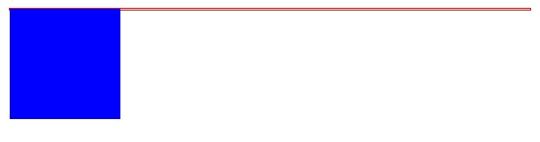
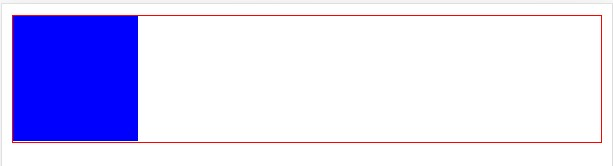

# 清除浮动

多个块级元素纵向排列可以用标准流实现，多个块级元素横向排列可以用 float（浮动）实现

它的特性为：

- 浮动元素会**脱离标准流**
  - 脱离标准流的控制（浮），移动到指定位置（动）
  - 浮动的盒子**不再保留原先的位置**
- 如果多个盒子都设置了浮动，则它们**一行显示并且顶端对齐排列**
- 任何元素都可以浮动，**浮动元素具有行内块元素的特点**
  - 如果块级盒子没有设置宽度，默认是和父级元素一样宽，但是添加浮动后，它的宽度根据内容来决定
  - 浮动的盒子中间是没有间隙的

## 浮动的取值

值：left | right | none | inherit

## 浮动布局的注意点

- 一般浮动布局时，需要和父盒子搭配

  先用父盒子排列上下位置，之后内部子元素采用浮动左右排列

- 一个元素浮动了，理论上其余的兄弟元素也要浮动

  浮动的盒子只会影响盒子后面的标准流，不会影响前面的标准流

## 清除浮动

使用浮动可能会导致父盒子高度坍塌，如下面例子所示：

```html
<style>
.container {
  border: 1px solid red;
}
.float-left {
  float: left;
}
.cube {
  width: 100px;
  height: 100px;
  background: blue;
}
</style>

<div class="container">
  <div class="cube float-left"></div>
</div>
```

效果为：



而我们需要父元素的高度，将子元素包围起来，也就是清除浮动，清除浮动后的效果如下：



**清除浮动的本质**

- 清除浮动的本质就是清除浮动元素造成的影响
- 如果父元素本身有高度，则不需要清除浮动
- 清除浮动之后，父级就会根据浮动的子盒子自动检测高度，父级有了高度，就不会影响下面的标准流了

**清除浮动的办法**

清除浮动的中心思想就是——闭合浮动，让浮动只影响父元素内部，不影响父元素外部。

清除浮动一般有四种办法，分别是：

1. 额外标签法——隔墙法，是 W3C 推荐的做法
2. 父级添加 :after 伪元素法
3. 父级添加双伪元素法
4. 父级添加 overflow 属性

(1) 额外标签法

前三个方法都需要用到一个属性 `clear`，`clear` 是专门用来清除浮动的属性。

使用 clear 的语法为：

```css
选择器 { clear: 属性值; }
```

`clear` 拥有的属性值列举如下：


| 属性值 | 描述                                       |
| ------ | ------------------------------------------ |
| left   | 不允许左侧有浮动元素（清除左侧浮动的影响） |
| right  | 不允许右侧有浮动元素（清除右侧浮动的影响） |
| both   | 同时清除左右两侧浮动的影响                 |

实际中，几乎只用到 `clear: both;`

下面是额外标签法的代码：

```html
<style>
  .clear {
    clear: both;
  }
</style>

<div>
  <!-- 前面有很多浮动元素 -->
  ...
  <div class="clear"></div>
</div>
```

- 优点：通俗移动，书写方便
- 缺点：添加许多无意义的标签，结构化较差

（2）父级添加 :after 伪元素

`:after` 方式是额外标签法的升级版，也是给父元素添加标签，只不过使用伪元素添加

```css
.clearfix:after {
  content: "";
  display: table;
  clear: both;
}
.clearfix { /- IE6, 7 专有 */
  *zoom: 1;
}
```

（3）父元素添加双伪元素清除浮动

这种方式和（2）类似

```css
.clearfix:before,
.clearfix:after {
  content: "";
  display: table;
}
.clearfix:after {
  clear: both;
}
.clearfix { /- IE6, 7 专有 */
  *zoom: 1;
}
```

（4）4.2.4 父级添加 overflow 属性

这是让父级元素符合 BFC 规范，BFC 规范本身就是元素内部形成一块隔离的空间，因此，只需要给父元素田间 `overflow: hidden;` 就可以了

```html
<style>
  .box {
    overflow: hidden;
  }
</style>

<div class="box">
  <!-- 很多浮动元素 -->
  ...
</div>
```
