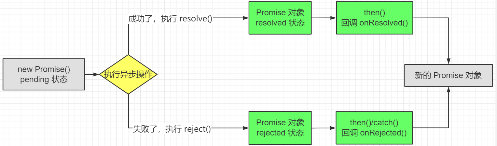

import Tabs from '@theme/Tabs';
import TabItem from '@theme/TabItem';

# 期约（Promise）

Promise 是 JavaScript 中进行异步编程的新的解决方法，从语法上看，Promise 是一个构造函数，从功能上看，Promise 用来封装一个异步操作并可以获取其结果

## Promise 的状态改变

* `pending` 变为 `resolved`
* `pending` 变为 `rejected`

说明：只有这两种改变方式，且一个 Promise 对象只能够改变一次

无论成功还是失败，都会有一个结果数据，成功的结果数据称为 `value`，失败的结果数据称为 `reason`。

## Promise 的基本流程



## Promise 的基本使用

### 以 nodejs 读取文件为例：

<Tabs>
<TabItem value="callback" label="回调函数" default>
```js
const fs = require("fs");

fs.readFile("./为学.md"， (err, data) => {
  if (err) { throw err; }
  console.log(data.toString());
});
```
</TabItem>
<TabItem value="promise" label="Promise">
```js
const fs = require("fs");

const p = new Promise(function (resolve, reject) {
  fs.readFile("./为学.md", (err, data) => {
    if (err) { reject(err); }
    resolve(data)
  });
});

p.then(function (value) {
  console.log(value.toString());
}, function (reason) {
  console.log("读取失败");
});
```
</TabItem>
</Tabs>

### 以连续读取三个文件为例

<Tabs>
<TabItem value="callback" label="回调函数" default>
```js
const fs = require("fs");

fs.readFile("./为学.md", (err, data1) => {
  fs.readFile("./插秧诗", (err, data2) => {
    fs.readFile("./观书有感", (err, data3) => {
      let result = data1 + '\n' + data2 + '\n' + data3;
      console.log(result);
    })
  })
})
```
</TabItem>
<TabItem value="promise" label="Promise">
```js
const fs = require("fs");
const p = new Promise((resolve, reject) => {
  fs.readFile("./为学.md", (err, data) => {
    resolve(data);
  });
});

p.then(value => {
  return new Promise((resolve, reject) => {
    fs.readFile("./插秧诗.md", (err, data) => {
      resolve([value, data]);
    });
  });
}).then(value => {
  return new Promise((resolve, reject) => {
    fs.readFile("./观书有感.md", (err, data) => {
      value.push(data);
      resolve(value);
    });
  });
}).then(value => {
  console.log(value[0] + "\n" + value[1] + "\n" + value[2]);
});
```
</TabItem>
</Tabs>

## 为什么使用 Promise

* Promise 支持链式调用，能够解决回调地狱问题

  传统的异步编程，会将函数嵌套调用，外部回调函数异步执行的结果是嵌套的回调函数的执行条件，这被称之为回调地狱。

  回调地狱倒置代码难以阅读和维护。

  Promise 支持链式调用，让代码能更加方便阅读和维护。

## 什么时候用 Promise.then() 的第二个函数，什么时候用 catch

- 适合使用 Promise.then() 第二个函数的情况
  - 成功和失败逻辑上非常紧密、比如读取文件成功、失败
  - 需要避免过多 catch 嵌套的场景
- 适合用 catch 的情况
  - Promise 链路全局错误捕获，类似于「兜底」
  - 统一处理所以错误信息，比如给用户显示错误信息
  - Promise.all、Promise.race 操作的情况

## Promise 的常见 API

| API | 类型 |说明 |
| -- | -- | -- |
| Promise(excutor) {} | excutor 类型为 `(resolve, reject) => {}` | Promise 的构造函数 |
| Promise.prototype.then | `(onResolved, onRejected) => {}` | onResolved 是成功时的回调函数, onRejected 是失败时的回调函数，它们能指定之后返回的新 Promise 对象 |
| Promise.prototype.catch | `(onRejected) => {}` | 失败时的回调函数 |
| Promise.resolve | `(value) => {}` | 返回一个成功的 Promise 对象 |
| Promise.reject | `(reason) => {}` | 返回一个失败的 Promise 对象 |
| Promise.all | `(promises) => {}`，promises 是包含 n 个 Promise 的数组 | 返回一个新的 Promise, **只有所有的 Promise 都成功才成功**, **只要有一个失败就直接失败** |
|Promise.race | `(promises) => {}` | 返回一个新的 Promise, **最先完成的 Promise 的状态就是最终的结果状态** |

## 举例学习 Promise 的细节

### 如何改变 Promise 的状态

1. `resolve(value)`: 如果当前是 pending 状态就变为 resolved
2. `reject(value)`: 如果当前是 pending 状态就变为 rejected
3. 抛出异常: 如果当前是 pending 状态就变为 rejected

```javascript
const p = new Promise((resolve, reject) => {
    throw new Error("出错了");
});
console.log(p); // rejected 的 Promise
```

### 一个 Promise 指定多个成功/失败回调函数, 都会调用吗

**一个 Promise 指定多个成功/失败回调函数, 都会调用**

<details>
<summary>展开代码示例</summary>
```js
const p = new Promise((resolve, reject) => {
  resolve(1);
});

p.then(value => {
  console.log("resolve 1");
});

p.then(value => {
  console.log("resolve 2");
});

p.then(value => {
  console.log("resolve 3");
});

// resolve 1
// resolve 2
// resolve 3
```
</details>

### Promise.prototype.then 返回的新 Promise 状态有什么决定

* 简单表达: 由 then() 指定的回调函数的执行结果决定
* 详细表达:
  * 如果抛出异常, 则新 Promise 状态为 rejected, reason 为抛出的异常
  * 如果返回的是非 Promise 的任意值, 则新 Promise 状态为 resolved, value 为返回的值
  * 如果返回的是 Promise, 则由 Promise 决定
  * 没有返回则相当于 `return undefined;`, 则新 Promise 状态为 resolved

<details>
<summary>展开代码示例</summary>
```javascript
const p = new Promise((resolve, reject) => {
  reject(1);
});

p.then(
  value => {
    console.log("resolve 1");
  },
  reason => {
    console.log("reject 1");
  }
).then(
  value => {
    console.log("resolve 2");
  },
  reason => {
    console.log("reject 2");
  }
);
// reject 1
// resolve 2
```
</details>

### Promise 可以串联多个同步和异步任务

<details>
<summary>展开代码示例</summary>

```js
new Promise((resolve, reject) => {
  setTimeout(() => {
    console.log("执行任务 1 —— 异步");
    resolve(1);
  }, 1000);
}).then(
  value => {
    console.log("任务 1 的结果: ", value);
    console.log("执行任务2 —— 同步");
    return 2;
  }
).then(
  value => {
    console.log("任务 2 的结果: ", value);
    return new Promise((resolve, reject) => {
      setTimeout(() => {
        console.log("执行任务 3 —— 异步");
        resolve(3);
      }, 1000);
    });
  }
).then(
  value => {
    console.log("任务 3 的结果: ", value);
  }
);
// 执行任务 1 —— 异步
// 任务 1 的结果:  1
// 执行任务2 —— 同步
// 任务 2 的结果:  2
// 执行任务 3 —— 异步
// 任务 3 的结果:  3
```
</details>

### Promise 异常穿透/传透

1. 当使用 then 链式调用时, 可以在最后指定失败的回调
2. 前面的任何操作出了异常, 都会传到最后失败的回调处理中

没写 `reason` 相当于 `reason => { throw reason; }`

### 中断 Promise 链

在 then 的回调函数中, 返回:

```js
return new Promise(() => {}); // 返回一个状态为 pending 的 Promise
```
