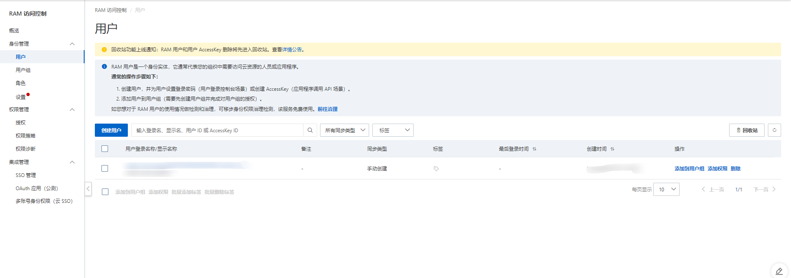
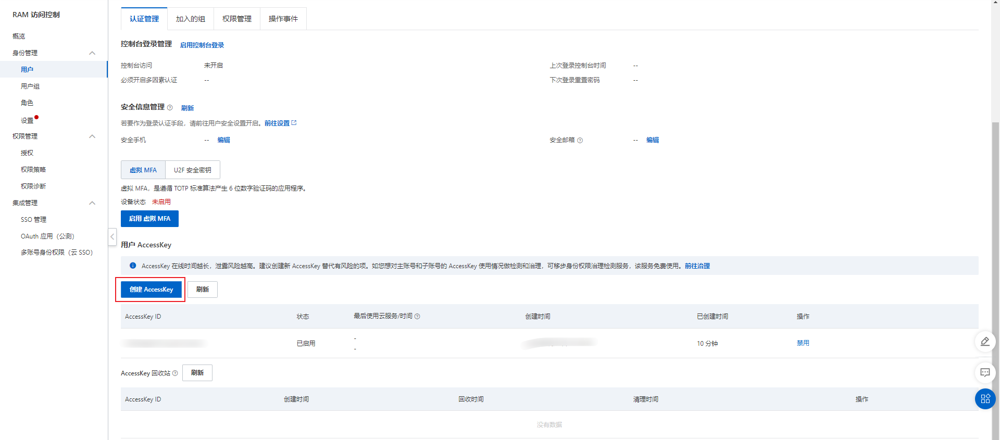
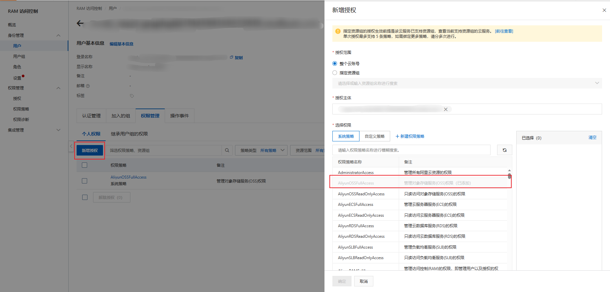
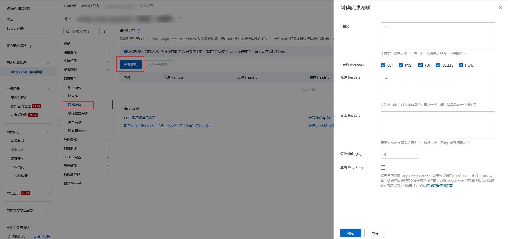

# oss

首先需要到阿里云的`身份管理/用户`中创建一个用户账号，



创建好用户后，我们可以给这个用户账号创建 AccessKey，这样就可以拿用户账号访问阿里云的 API 了。



有两种 API 上传图片到阿里云的方式。

- 服务端转发
  - 用服务端转发的话，请求我们自己的服务器会被收取一次费用，上传图片又会再收取一次费用
- Web 直传
  - 服务端会生成一个签名，然后将签名传递给客户端
  - 客户端通过签名，上传图片到阿里云 OSS

我们这里选择 Web 直传的方式，文档可以参考[服务端签名后直传](https://help.aliyun.com/document_detail/31926.html)

之后需要给用户组设置权限。



然后需要设置跨域



之后读和写都需要权限，我们这里需要设置公共读

https://help.aliyun.com/document_detail/177701.html?spm=a2c4g.149373.0.0.318f1955bLrLYc

## 服务端获取签名

```ts
import { Injectable } from '@nestjs/common';
import * as OSS from 'ali-oss';
import * as dayjs from 'dayjs';

import {
  aliyunAccessKeyId,
  aliyunAccessKeySecret,
  aliyunBucket,
} from 'src/password.config';
import { OSSType } from './dto/oss.type';

@Injectable()
export class OSSService {
  async getSignature(): Promise<OSSType> {
    const config = {
      accessKeyId: aliyunAccessKeyId,
      accessKeySecret: aliyunAccessKeySecret,
      bucket: aliyunBucket,
      dir: 'images/',
    };
    const client = new OSS(config);
    const date = new Date();
    date.setDate(date.getDate() + 1);
    const policy = {
      expiration: date.toISOString(), // 请求的超时时间。
      conditions: [
        ['content-length-range', 0, 1048576], // 设置上传文件的大小限制 1MB
      ],
    };

    // 调用SDK获取签名
    const formData = await client.calculatePostSignature(policy);

    return {
      expire: dayjs().add(1, 'days').unix().toString(),
      policy: formData.policy,
      signature: formData.Signature,
      accessId: formData.OSSAccessKeyId,
    };
  }
}
```

## 客户端上传图片

客户端上传图片时，会发送两个网络请求：

- 第一个请求的目的是获取签名，这一步骤我我使用 graphql 完成，由客户端发送给开发者服务器。
- 第二个请求的目标是上传图片，这一步骤我使用原生 fetch 完成，由客户端发送给 OSS 服务器。

我将两个网络请求封装成一个名叫 useOSSUpload 的 hooks。

```ts
// 定义 graphql 获取签名的 gql
import { gql } from '@apollo/client'

export const GET_SIGNATURE = gql`
  query getSignature {
    getSignature {
      expire
      accessId
      signature
      policy
      host
    }
  }
`
```

```ts
// 封装 useOSSUpload hooks，返回一个上传图片的函数 uploadHandler
export const useOSSUpload = () => {
  const { data: d } = useQuery(GET_SIGNATURE)
  const uploadHandler = async (file: File): Promise<{ url: string }> => {
    const formData = new FormData()
    const data = d.getSignature
    const key = `images/${file.name}`
    formData.append('key', key)
    formData.append('policy', data.policy)
    formData.append('OSSAccessKeyId', data.accessId)
    formData.append('success_action_status', '200')
    formData.append('Signature', data.signature)
    formData.append('file', file)
    const res = await fetch(data.host, {
      method: 'POST',
      body: formData,
    })

    return {
      url: res.url + key,
    }
  }

  return uploadHandler
}
```

通过使用 uploadHandler，我们可以上传图片。我们这里以 Antd 为例：

```jsx
import { Form, ImageUploader } from 'antd-mobile'
import { useOSSUpload } from './hooks/useOSSUpload'

function App() {
  const uploadhandler = useOSSUpload()
  return (
    <Form>
      <Form.Item label="上传图片">
        <ImageUploader upload={uploadhandler}></ImageUploader>
      </Form.Item>
    </Form>
  )
}

export default App
```