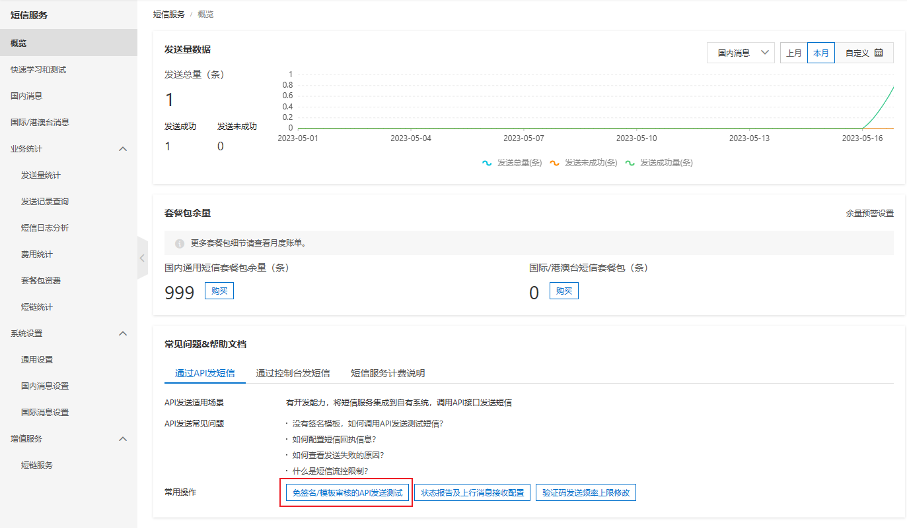
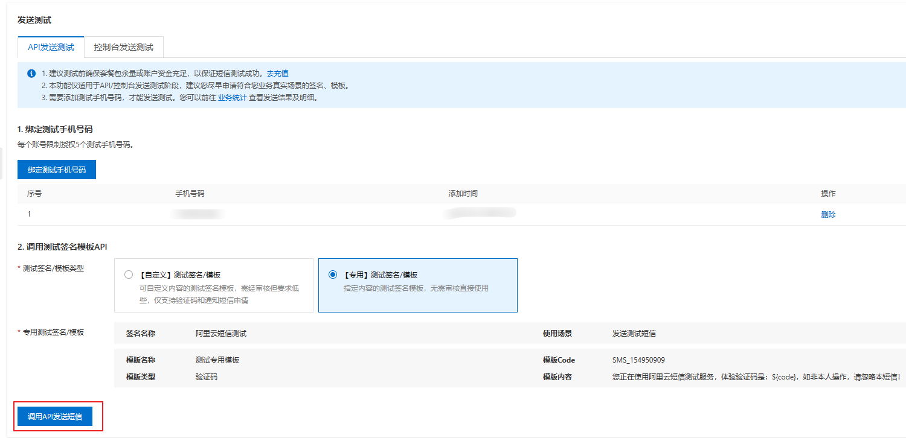

# sms

我们开发一个产品时，往往需要用到短信验证码功能，为此我们可以选择「阿里云短信服务」。

可以访问 [阿里云短信服务](https://dysms.console.aliyun.com/overview)。

## 使用测试模板

选择「通过 API 发短信」->「免签名/模板审核的 API 发送测试」



为了快速上手阿里云短信服务，我们在绑定测试手机号后，可以先不选择申请模板，而是先使用「【专用】测试签名/模板」。



之后我们可以直接点击调用，看看是否有验证码发送到我们的手机上。


## 编写调用的 API 的代码

我们可以选择「SDK 示例」，查看相关语言的例子，因为我使用的是 Nest.js，所以选择 TypeScript。


```ts
import { Injectable } from '@nestjs/common';
import Dysmsapi20170525, * as $Dysmsapi20170525 from '@alicloud/dysmsapi20170525';
import * as $OpenApi from '@alicloud/openapi-client';
import Util, * as $Util from '@alicloud/tea-util';
import {
  aliyunAccessKeyId,
  aliyunAccessKeySecret,
  signName,
  templateCode,
} from 'src/password.config';
import { getRandomCode } from 'src/shared/utils';

@Injectable()
export class SMSService {
  async sendVerificationCode(tel: string): Promise<string> {
    const code = getRandomCode(4);
    const config = new $OpenApi.Config({
      accessKeyId: aliyunAccessKeyId,
      accessKeySecret: aliyunAccessKeySecret,
    });
    config.endpoint = 'dysmsapi.aliyuncs.com';
    const client = new Dysmsapi20170525(config);
    const sendSmsRequest = new $Dysmsapi20170525.SendSmsRequest({
      signName: signName,
      templateCode: templateCode,
      phoneNumbers: tel,
      templateParam: `{"code":"${code}"}`,
    });
    const runtime = new $Util.RuntimeOptions({});
    try {
      await client.sendSmsWithOptions(sendSmsRequest, runtime);
    } catch (error) {
      Util.assertAsString(error.message);
    }
    return code;
  }
}
```

## 访问控制

之后我们需要到阿里云访问控制，为我们的身份添加权限。


调用代码后，我们就可以直接收到短信了。