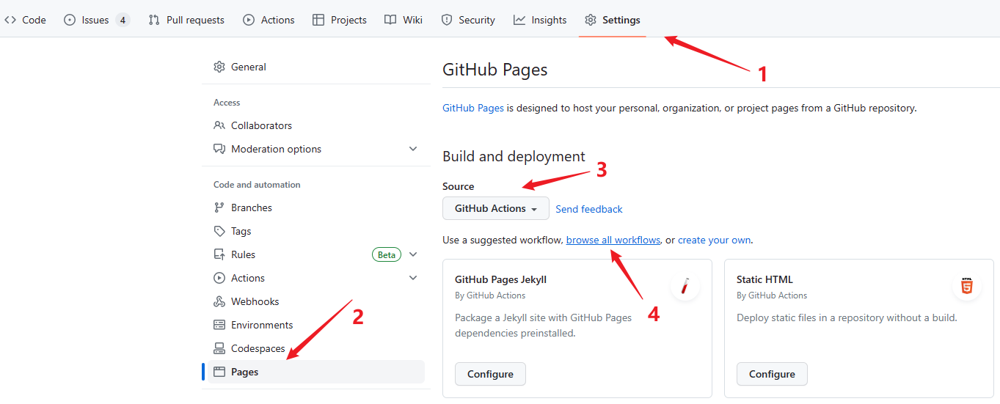
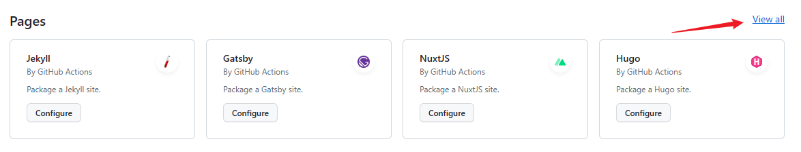

# github pages

通过使用 GitHub Actions 的 workflow（工作流）的模板，我们可以快速部署网站到 github.io 域名下。

1. GitHub 仓库中，选择 Settings -> Pages -> GitHub Actions -> browse all workflows

2. 点击 Pages 右侧的 View all 按钮

3. 选择 mdBook，点击 Configure 按钮

4. 之后 GitHub 会自动创建一个 yml 文件

5. 我们可以将整个仓库克隆到本地，按照 [mdBook 官方指南](https://rust-lang.github.io/mdBook/) 的指导书写 Markdown 文件。当我们提交后，会自动触发 GitHub Actions 将网站部署到 GitHub Pages 下。

感兴趣的朋友可以参考我的博客：

- 博客网址：[https://lijunlin2022.github.io/blog](https://lijunlin2022.github.io/blog)
- 博客源码：[https://github.com/lijunlin2022/blog](https://github.com/lijunlin2022/blog)

