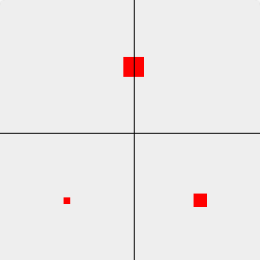
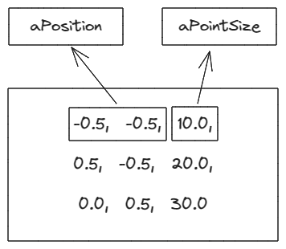

# 多缓冲区和数据偏移

上一节介绍了如何利用缓冲区绘制多个点，这节介绍如何创建多缓冲区。

比如同样要画三个点，三个点的位置不一样，大小也不一样，我们可以这样写：



```js
...
const VERTEX_SHADER_SOURCE = `
  attribute vec4 aPosition;
  attribute float aPointSize;
  void main() {
    gl_Position = aPosition;
    gl_PointSize = aPointSize;
  }
`
...
const program = initShader(gl, VERTEX_SHADER_SOURCE, FRAGMENT_SHADER_SOURCE)
const aPosition = gl.getAttribLocation(program, 'aPosition')
const aPointSize = gl.getAttribLocation(program, 'aPointSize')

// highlight-start
const points = new Float32Array([
  -0.5, -0.5,
  0.5, -0.5,
  0.0, 0.5
])

const buffer = gl.createBuffer()
gl.bindBuffer(gl.ARRAY_BUFFER, buffer)
gl.bufferData(gl.ARRAY_BUFFER, points, gl.STATIC_DRAW)
gl.vertexAttribPointer(aPosition, 2, gl.FLOAT, false, 0, 0)
gl.enableVertexAttribArray(aPosition)
// highlight-end

// highlight-start
const size = new Float32Array([
  10.0,
  20.0,
  30.0
])

const sizeBuffer = gl.createBuffer()
gl.bindBuffer(gl.ARRAY_BUFFER, sizeBuffer)
gl.bufferData(gl.ARRAY_BUFFER, size, gl.STATIC_DRAW)
gl.vertexAttribPointer(aPointSize, 1, gl.FLOAT, false, 0, 0)
gl.enableVertexAttribArray(aPointSize)
// highlight-end

gl.drawArrays(gl.POINTS, 0, 3)
```

不难看出，两段代码的相似程度很高，有什么办法可以降低代码重复度吗？

这时候就需要用到代码偏移，代码如下：

```js
...
const points = new Float32Array([
  -0.5, -0.5, 10.0,
  0.5, -0.5, 20.0,
  0.0, 0.5, 30.0
])

const buffer = gl.createBuffer()
gl.bindBuffer(gl.ARRAY_BUFFER, buffer)
gl.bufferData(gl.ARRAY_BUFFER, points, gl.STATIC_DRAW)

const BYTES = points.BYTES_PER_ELEMENT
// highlight-next-line
gl.vertexAttribPointer(aPosition, 2, gl.FLOAT, false, BYTES * 3, 0)
gl.enableVertexAttribArray(aPosition)
// highlight-next-line
gl.vertexAttribPointer(aPointSize, 1, gl.FLOAT, false, BYTES * 3, BYTES * 2)
gl.enableVertexAttribArray(aPointSize)

gl.drawArrays(gl.POINTS, 0, 3)
```

我们可以复习一下 `vertexAttribPointer` 的使用方法：

```js
gl.vertexAttribPointer(location, size, type, normalized, stride, offset)
```

- location，attribute 变量的存储地址
- size，没绘制一个顶点需要几个数据
- type，指定数据格式
  - gl.FLOAT，浮点型
  - gl.UNSIGNED_BYTE，无符号字节
  - gl.SHORT，短整型
  - gl.UNSIGNED_SHORT，无符号短整型
  - gl.INT，整型
  - gl.UNSIGNED_INT，无符号整型
- normalized，表示是否将数据归一化到 [0, 1] [-1, 1] 这个区间
- stride，两个相邻顶点之间的字节数
- offset，数据偏移量


