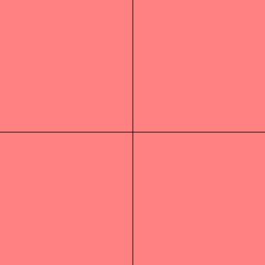
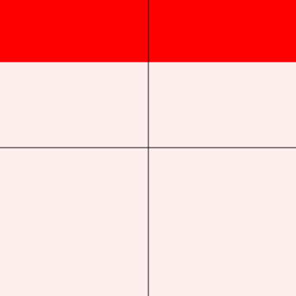
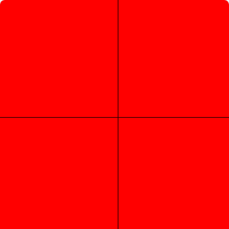

# 片元着色器动画

## 渐入渐出



关键代码如下：

```js
// ... 省略
// unifrom 必须在 main 函数外面
const FRAGMENT_SHADER_SOURCE = `
  precision lowp float;
  uniform float uOpacity;
  void main() {
    gl_FragColor = vec4(1.0, 0.0, 0.0, uOpacity);
  }
`
// ... 省略
let p = 0
let increasing = true
function animation () {
  if (increasing) {
    p = p + 0.02
    if (p >= 1) {
      p = 1
      increasing = false
    }
  } else {
    p = p - 0.02
    if (p <= 0) {
      p = 0
      increasing = true
    }
  }
  gl.uniform1f(uOpacity, p)
  gl.drawArrays(gl.TRIANGLE_STRIP, 0, 4)

  requestAnimationFrame(animation)
}

animation()
```

## 卷入卷出



关键代码如下：

```js
const VERTEX_SHADER_SOURCE = `
  attribute vec4 aPosition;
  varying vec4 vPosition;
  void main() {
    gl_Position = aPosition;
    vPosition = aPosition;
  }
`

// 向上卷出时，vPosition.y > uHeight
const FRAGMENT_SHADER_SOURCE = `
  precision lowp float;
  uniform float uHeight;
  varying vec4 vPosition;
  void main() {
    if (vPosition.y > uHeight) {
      gl_FragColor = vec4(1.0, 0.0, 0.0, 1.0);
    } else {
      gl_FragColor = vec4(1.0, 0.0, 0.0, 0.0);
    }
  }
`

// ... 省略
let p = -1
let up = true
function animation () {
  if (up) {
    p = p + 0.02
    if (p >= 1) {
      p = 1
      up = false
    }
  } else {
    p = p - 0.02
    if (p <= -1) {
      p = -1
      up = true
    }
  }

  gl.uniform1f(uHeight, p)
  gl.drawArrays(gl.TRIANGLE_STRIP, 0, 4)

  requestAnimationFrame(animation)
}

animation()
```

## 百叶窗



关键代码如下：

```js
// ... 省略
const FRAGMENT_SHADER_SOURCE = `
  precision lowp float;
  uniform float uHeight;
  varying vec4 vPosition;
  void main() {
    if (vPosition.y < 1.0 && vPosition.y > 0.5) {
      if (vPosition.y > uHeight) {
        gl_FragColor = vec4(1.0, 0.0, 0.0, 1.0);
      } else {
        gl_FragColor = vec4(1.0, 0.0, 0.0, 0.0);
      }
    }
    if (vPosition.y < 0.5 && vPosition.y > 0.0) {
      if (vPosition.y > uHeight - 0.5) {
        gl_FragColor = vec4(1.0, 0.0, 0.0, 1.0);
      } else {
        gl_FragColor = vec4(1.0, 0.0, 0.0, 0.0);
      }
    }
    if (vPosition.y < 0.0 && vPosition.y > -0.5) {
      if (vPosition.y > uHeight - 1.0) {
        gl_FragColor = vec4(1.0, 0.0, 0.0, 1.0);
      } else {
        gl_FragColor = vec4(1.0, 0.0, 0.0, 0.0);
      }
    }
    if (vPosition.y < -0.5 && vPosition.y > -1.0) {
      if (vPosition.y > uHeight - 1.5) {
        gl_FragColor = vec4(1.0, 0.0, 0.0, 1.0);
      } else {
        gl_FragColor = vec4(1.0, 0.0, 0.0, 0.0);
      }
    }
  }
`
// ... 省略
let p = 1
function animation () {
  p = p - 0.02

  gl.uniform1f(uHeight, p)
  gl.drawArrays(gl.TRIANGLE_STRIP, 0, 4)

  requestAnimationFrame(animation)
}

animation()
```

加入循环后代码如下：

```js
// ... 省略
const FRAGMENT_SHADER_SOURCE = `
  precision lowp float;
  uniform float uHeight;
  varying vec4 vPosition;
  uniform float uList[5];
  void main() {
    for (int i = 0; i < 4; i++) {
      if (vPosition.y > uList[i + 1] && vPosition.y < uList[i]) {
        if (vPosition.y > uHeight - float(i) * 0.5) {
          gl_FragColor = vec4(1.0, 0.0, 0.0, 1.0);
        }
      }
    }
  }
`
// ... 省略
gl.uniform1fv(uList, [1.0, 0.5, 0.0, -0.5, -1.0])
// ... 省略
```
