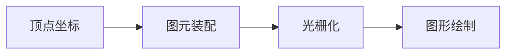

# 渲染流程

- 图元装配流程：

将独立的顶点坐标装配成几何图形，图形的类别由 gl.drawArrays() 第一个参数确定

- 光栅化

这一步是将装配好的图形转换为片元。

- 剔除

如果是不透明物体，背面对于观察者来说是不可见的。那么在渲染过程中，就会将不可见的部分剔除，不参与绘制。节省渲染开销。

- 裁剪

在可视范围外的事物，是看不到的。图形生成后，有的部分可能位于可视范围之外，这一部分会被剪裁掉，不参与绘制。
