## 修改 IIS 配置，将错误信息发送到浏览器

此步骤非必要，但可以方便调试，故放在第一步

直接看图：

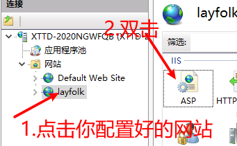

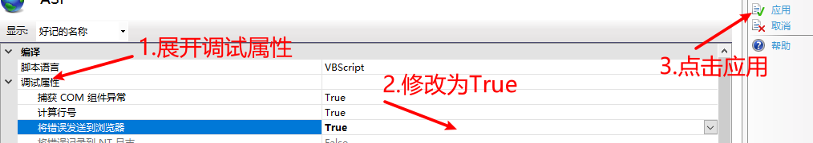

## 创建数据库

首先创建数据库，打开你的 Access

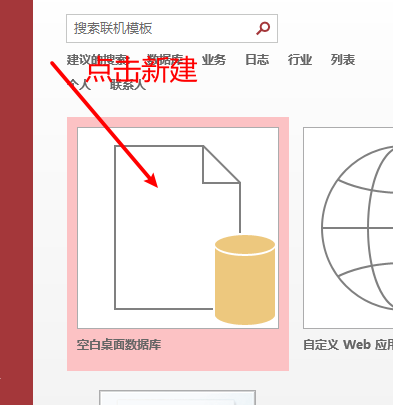

然后选择保存类型、保存位置。这里选择 mdb 的原因，是因为我的电脑 accdb 类型会出错。

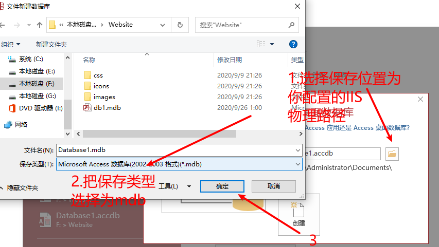

然后创建表并保存：

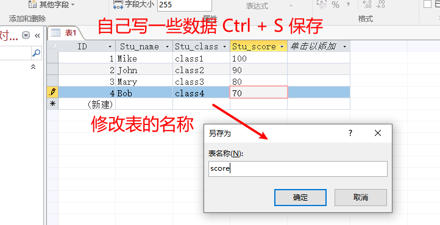

之后关闭数据库。

## 编写asp文件连接数据库

我继续用 test.asp 文件做演示，在 asp 中拷贝下面的代码：(一个 `'` 是 asp 中注释的写法)

```
<%
  set conn = Server.CreateObject("ADODB.Connection")
  conn.Provider = "Microsoft.Jet.OLEDB.4.0"

  ' 填写你创建的数据库绝对路径
  conn.Open("f:\Website\Database1.mdb")

  set rs = Server.CreateObject("ADODB.recordset")
  rs.Open "select * from score", conn

  do until rs.EOF
    for each x in rs.fields
      response.Write(x)
    next
    response.Write("<br>")
    rs.MoveNext
  loop
%>
```

在浏览器中输入你自己 test.asp 的路径，我输入的是：http://localhost:8080/test.asp

应该可以看到：（对比之后看到正是数据库中的内容，证明数据库已经连接成功）

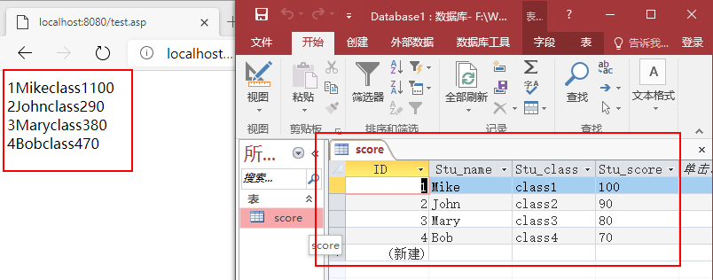

如果报错，可能是需要你修改IIS的配置，启用32位的配置，如下图：

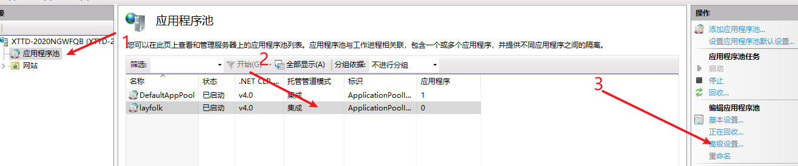
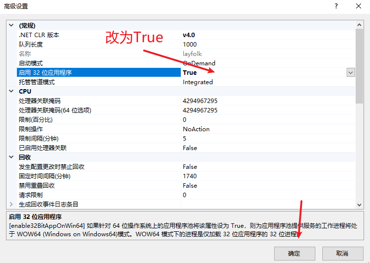

## 解释 asp 连接数据库的代码

asp 中写代码默认使用的语言是 VBScript，它的具体语法我不是很熟，我只把各个部分的含义解释一下。如下图

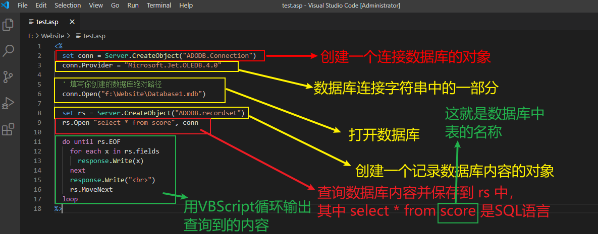

## 表格展示数据库中的内容

```
<!DOCTYPE html>
<html>
<head>
    <title></title>
    <meta charset="utf-8">
</head>
<body>
  <table width="100%" border="1">
  <%
    set conn = Server.CreateObject("ADODB.Connection")
    conn.Provider = "Microsoft.Jet.OLEDB.4.0"

    ' 填写你创建的数据库绝对路径
    conn.Open("f:\Website\Database1.mdb")

    set rs = Server.CreateObject("ADODB.recordset")
    rs.Open "select * from score", conn

    do until rs.EOF
    response.Write("<tr>")
      for each x in rs.fields
        response.Write("<td>")
        response.Write(x)
        response.Write("</td>")
      next
      rs.MoveNext
    response.Write("</tr>")
    loop
  %>
  </table>
<body>
</html>
```

效果如下：

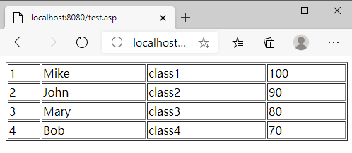

## 极限更新，添加数据到数据库：

首先是 test.asp 文件的内容：

```
<!DOCTYPE html>
<html>
<head>
    <title></title>
    <meta charset="utf-8">
</head>
<body>

  <form method="post" action="table.asp">
    请输入学生姓名:<input name="stu_name" type="text">  <br>
    请输入学生班级:<input name="stu_class" type="text"> <br>
    请输入学生成绩:<input name="stu_score" type="text">  <br>
    <input type="submit" value="提交">
  </form>
  
  <table width="100%" border="1">
  <%
    set conn = Server.CreateObject("ADODB.Connection")
    conn.Provider = "Microsoft.Jet.OLEDB.4.0"

    ' 填写你创建的数据库绝对路径
    conn.Open("f:\Website\Database1.mdb")

    set rs = Server.CreateObject("ADODB.recordset")
    rs.Open "select * from score", conn

    do until rs.EOF
    response.Write("<tr>")
      for each x in rs.fields
        response.Write("<td>")
        response.Write(x)
        response.Write("</td>")
      next
      rs.MoveNext
    response.Write("</tr>")
    loop

    conn.Close()
  %>
  </table>
<body>
</html>
```

然后是 table.asp 的内容：

```
<!DOCTYPE html>
<html>
<head>
    <title></title>
    <meta charset="utf-8">
</head>
<body>
<%
    set conn = Server.CreateObject("ADODB.Connection")
    conn.Provider = "Microsoft.Jet.OLEDB.4.0"

    ' 填写你创建的数据库绝对路径
    conn.Open("f:\Website\Database1.mdb")

    ' sql插入数据表的例子如下：insert into score(stu_name, stu_class, stu_score) values('Mike', 'class1', '100')
    sql = "insert into score(stu_name, stu_class, stu_score) values"
    sql = sql & "(' " &Request.Form("stu_name")& "', "
    sql = sql & " ' " &Request.Form("stu_class")& "', "
    sql = sql & " ' " &Request.Form("stu_score")& " ')"

    conn.Execute sql, recaffected

    conn.Close()
%>

<a href="test.asp">Go back to the previous page</a>
</body>
</html>
```

效果如下：

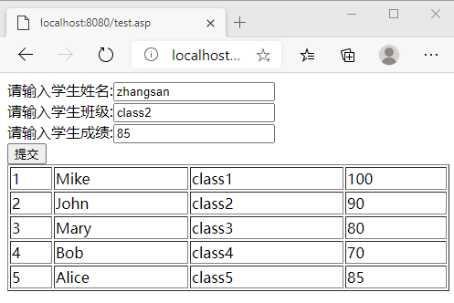

首先是 test.asp 界面：

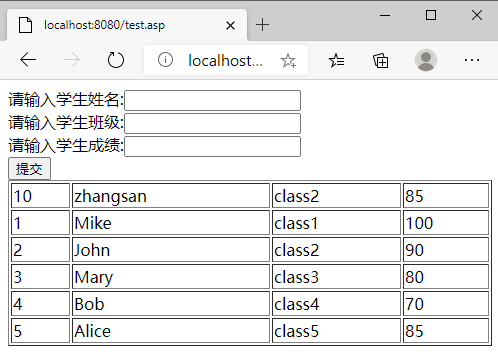

点击提交之后会跳转到 table.asp 界面：

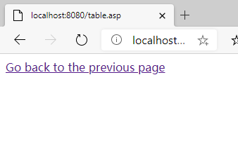

然后点击链接返回 test.asp 界面，相当于刷新（临时写的，其实可以不那么麻烦），可以看到新记录已经插入到数据库了。
