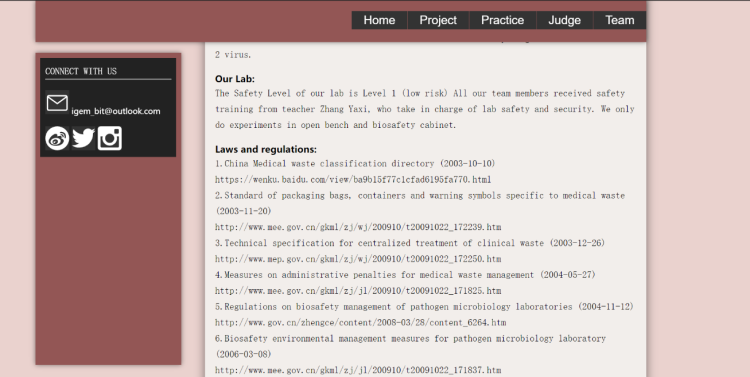
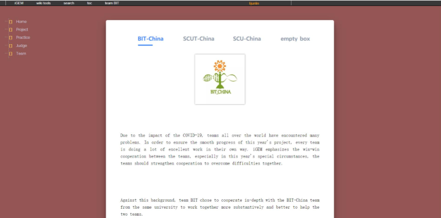
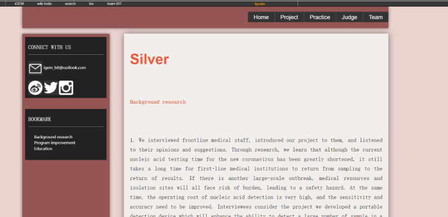
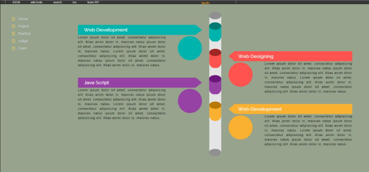
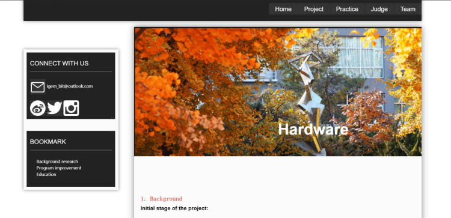
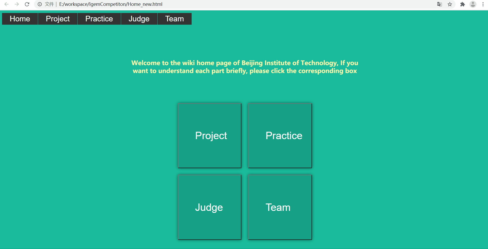
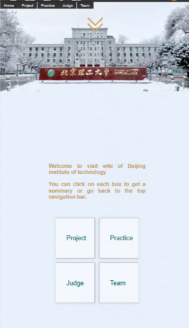
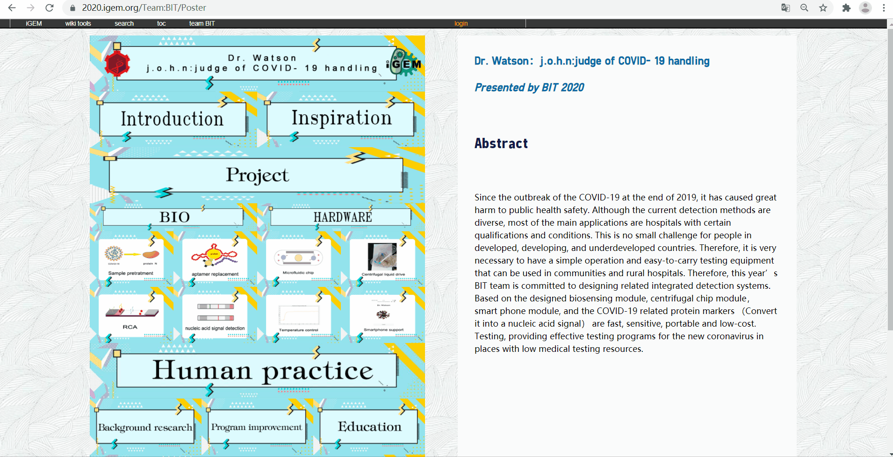

## 成果

- Wiki 效果：[https://2020.igem.org/Team:BIT](https://2020.igem.org/Team:BIT)
- Poster 效果：[https://2020.igem.org/Team:BIT/Poster](https://2020.igem.org/Team:BIT/Poster)

## 比赛规则

- 官方规则：[https://2020.igem.org/Competition/Deliverables/Wiki](https://2020.igem.org/Competition/Deliverables/Wiki)
- 哔哩哔哩视频，规则讲解：[https://www.bilibili.com/video/av968823530](https://www.bilibili.com/video/av968823530)
- 四川大学的一位前辈：[http://www.xiaomaidong.com/?p=321](http://www.xiaomaidong.com/?p=321)

## 比赛过程

这次队伍由 3 位 18 级计算机学院的同学，和一位 19 级的同学组成。开始时，我安排队员们学习 Vue.js + Element Ui，因为我查看网页，上一届的队伍就用了 Vue。
但之后了解比赛详情后，我意识到，把 Vue 项目打包再部署到 IGEM 网站的方式是不可行的。要使用 Vue，只能直接引入 js 文件。

IGEM 官网不允许使用 CDN 方式引入外部文件，所以我必须将 Vue.js 和 Element.js，Element.css 上传之后才能使用。而 Element.css 中又引入了很多字体和图片，所以我也需要把这些字体和图片上传到 IGEM 的官网。这太繁琐了。于是我放弃了使用 Vue。只使用 HTML、CSS、JavaScript 和 JQuery。

我们队伍没有美工，于是我参照了一些博客的样式来写代码。



然后经过我的死亡调色，变成了这样。





这时候我已经觉得蛮可以了，然后自习时遇见了黛玉大佬，他看了看，露出尴尬而不失礼貌的微笑。于是我明白了，黛玉大佬是在嫌弃网页丑陋。
这我可不能忍啊，劳动的结晶怎么能被如此糟蹋呢!

于是我决定美化页面，在参考了大量博客的设计之后，我发现极简的博客想要好看，关键在于大图。

于是我调 css 调出来了这个页面，效果还不错。于是决定其他页面都按照这个风格来。



图片都是从北京理工大学的图库平台拿到的：[http://www.bit.edu.cn/tkpt/](http://www.bit.edu.cn/tkpt/)

在主要页面确定之后，我需要考虑首页，首页是一个网站最吸引人的地方，一定不能大意。当然，这些酷炫的效果，单凭我自己是没办法短时间内写出来的，我是用了插件。这是一个开源的插件库：[jQuery 之家](http://www.htmleaf.com/)。

我换了三次首页效果，最后效果是：




选中这个效果之后，就开始了调色之旅。
下面这个效果，其实是一张铺满全部背景的图片，上面再覆盖一张北理工正门的图片。（铺满地面的雪花就是那张铺满全部背景的图片）



在模板全部确定之后，就是等待文稿然后复制粘贴了，都是重复的工作。

最后是制作海报：

- Wiki 的截至日期是美国东部时间 10.27，这之后还有海报需要制作，我们是使用了官方的海报模板。我们做出的效果如下。



## 踩坑经验

- css 的引入
  
js、css 文件的引入方法参照对应年份的规则，往年学长的引入方法今年不一定适用。

- IGEM 自带 css 样式，会干扰自定义的 css

在比赛规则的视频还有博客里，都提及了这个问题。你需要用代码来 IGEM 原来的样式，这里提供一份基本的覆盖的代码。

```css
home_logo, #sideMenu {
  display: none;
}
sideMenu, #top_title, .patrollink {
  display: none;
}
content {
  margin-left: 0px;
  margin-right: 0px;
  margin-top:-7px;
  padding: 0px;
  width: 100%;
  background-color: rgba(0,0,0,0);
}
bodyContent h1, #bodyContent h2, #bodyContent h3, #bodyContent h4, #bodyContent h5 {
  margin-bottom: 0px;
}
bodyContent a[href ^="https://"], .link-https {
  padding-right:0px;
}
.judges-will-not-evaluate {
  border: 4px solid #F42534; padding: 2% !important; width: 92%!important;
}
```

这份代码只实现了基础的覆盖，具体情况还需要具体分析。

<details>
  <summary>2022 补充</summary>

如果后续学弟学妹熟悉 Vue 框架，建议还是使用 Vue。因为当网页基本样式调好后，如果使用 Vue，可以把文本都放在 Vue 实例中的 data 中，而不需要手动复制黏贴，这会节省很多时间。
  
IGEM 其实看重的还是 CSS 效果，如果 CSS 功底或者审美不好，建议还是多找一些 CSS 插件。
</details>
