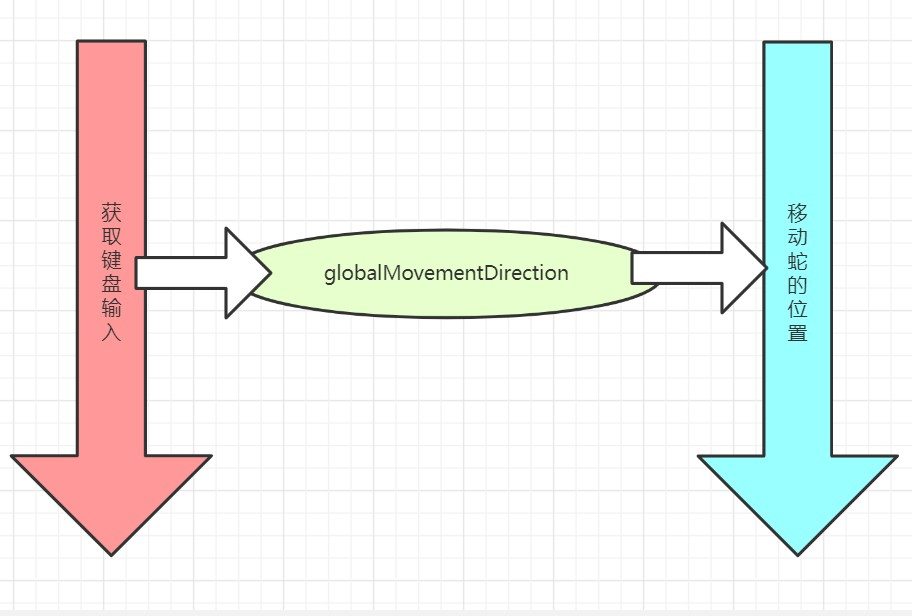

本文介绍了游戏中如何使用双线程，完成获取键盘输入控制贪吃蛇移动，为此我们需要学习两个函数，CreateThread 和 GetAsyncKeyState

## 双线程的作用



在我们的设计中，开了两个线程，第一个线程用于获取键盘输入，它将影响一个全局变量 `globalMovementDirection` ，当需要移动蛇的时候，第二个线程将读取 `globalMovementDirection` 作为控制信号

## CreateThread 的用法

> * 语法
>
>   ```c
>   HANDLE CreateThread(
>     LPSECURITY_ATTRIBUTES lpsa,
>     DWORD cbStack,
>     LPTHREAD_START_ROUTINE lpStartAddr,
>     LPVOID lpvThreadParam,
>     DWORD fdwCreate,
>     LPDWORD lpIDThread
>   );
>   ```
>
> * 参数
>
>   * lpsa，忽略，必须为 NULL
>   * cbStack，忽略
>   * lpStartAddr，线程的起始地址
>   * lpvThreadParam，指向传递给线程的单个 32 位参数值的长指针
>   * fdwCreate，执行控制线程创建的标志
>   * lpIDThread，指向接收线程标识符的 32 位变量的长指针，如果此参数为 NULL，则不反悔线程标识符
>
> ——[CreateThread | Microsoft Docs](https://docs.microsoft.com/en-us/previous-versions/bb202727(v=msdn.10)?redirectedfrom=MSDN)

## 实际创建线程的代码

在 `main` 函数中，我们有：

```c
void main() {
	__asm {
		// 第一个线程
		// 获取键盘输入
		// 操控蛇的移动
		push 0
		push 0
		push 0
		lea eax, dword ptr ds : [judgeMovementDirection]
		push eax
		push 0
		push 0
		call CreateThread

		// 第二个线程
		// 打印游戏画面
		call enterGame
	}
}
```

可以知道，第一个线程中就只有函数 `judgeMovementDirection` 在运行，而 `judgeMovementDirection` 就是的功能就是修改 `globalMovementDirection` 变量

## GetAsyncKeyState

> GetAsyncKeyState 是一个用来判断函数调用时指定虚拟键的状态，确定用户当前是否按下了键盘的一个键的函数。如果按下，则返回值最高位为 1
>
> * 语法
>
>   ```c
>   SHORT GetAsyncKeyState(
>     int vKey
>   );
>   ```
>
> * 参数
>
>   * `vKey`
>
>     有关详细信息，请参阅[虚拟键代码](https://docs.microsoft.com/en-us/windows/win32/inputdev/virtual-key-codes)
>
> 对 GetAsyncKeyState 调用之后，如果按键已经被按下，则返回值位 15 设为 1；如抬起，则为 0
>
> —— [GetAsyncKeyState 百度百科](https://baike.baidu.com/item/GetAsyncKeyState/918387?fr=aladdin)
>
> —— [GetAsyncKeyState | Microsoft Docs](https://docs.microsoft.com/en-us/windows/win32/api/winuser/nf-winuser-getasynckeystate)

## 实际判断状态的代码

需要注意的时，贪吃蛇不能够直接掉头，所以在给 `globalMovementDirection` 赋值时，必须首先判断此时蛇的移动方向

* 如果蛇向下移动，则向上的按键不生效
* 如果蛇向上移动，则向下的按键不生效
* 如果蛇向左移动，则向右的按键不生效
* 如果蛇向右移动，则向左的按键不生效

```c
void  judgeMovementDirection() {
	while (true) {
		__asm {
	back_while:
		// 获取 w 键
		push 87
		call GetAsyncKeyState
		// 与操作，获取第 15 位的值
		and ax, 0ff00h
		// 如果为 0 表示没有被按下
		cmp ax, 0
		jne w_press

		// 获取 s 键
		push 83
		call GetAsyncKeyState
		and ax, 0ff00h
		cmp ax, 0
		jne s_press

		// 获取 a 键
		push 65
		call GetAsyncKeyState
		and ax, 0ff00h
		cmp ax, 0
		jne a_press

		// 获取 d 键
		push 68
		call GetAsyncKeyState
		and ax, 0ff00h
		cmp ax, 0
		jne d_press
		jmp back_while

		// 如果 w 键被按下
	w_press :
		mov eax, dword ptr ds : [globalMovementDirection]
		// 如果当前移动方向向下, 则忽略此次事件
		cmp eax, 2
		je w_back
		mov dword ptr ds : [globalMovementDirection] , 1
		w_back :
		jmp back_while

		// 如果 s 键被按下
	s_press :
		mov eax, dword ptr ds : [globalMovementDirection]
		// 如果当前移动方向向上, 则忽略此次事件
		cmp eax, 1
		je s_back
		mov dword ptr ds : [globalMovementDirection] , 2
		s_back :
		jmp back_while

		// 如果 a 键被按下
	a_press :
		mov eax, dword ptr ds : [globalMovementDirection]
		// 如果当前移动方向向右, 则忽略此次事件
		cmp eax, 4
		je a_back
		mov dword ptr ds : [globalMovementDirection] , 3
		a_back :
		jmp back_while

		// 如果 d 键被按下
	d_press :
		mov eax, dword ptr ds : [globalMovementDirection]
		// 如果当前移动方向向左, 则忽略此次事件
		cmp eax, 3
		je d_back
		mov dword ptr ds : [globalMovementDirection] , 4
		d_back :
		jmp back_while
		}
	}
}
```
