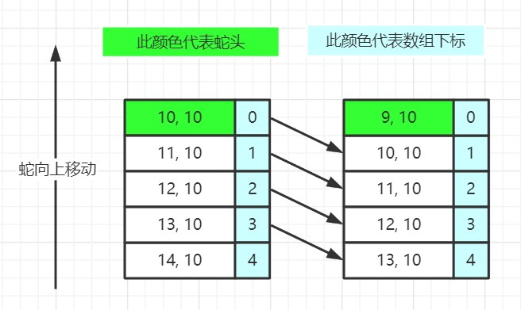
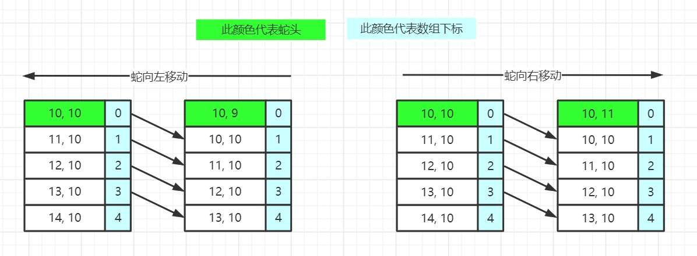
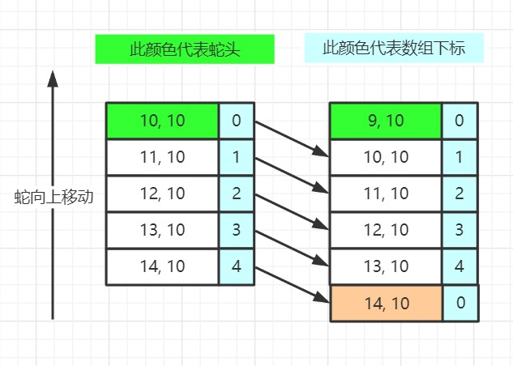

上一篇我们了解到，蛇身体的每一个点的坐标被存储在结构体中。这篇我们使用图片来演示蛇是如何移动，以及当蛇的长度增长时，又是如何实现增加的。本篇算是整个汇编贪吃蛇的重中之重

## 存储蛇的结构体

在上一篇文章中我们已经知道，蛇的位置是由结构体来存储的：

```c
struct SnakePos {
	int x;
	int y;
} globalSnakeArr[100];
```

其中，`globalSnakeArr[i].x` 和 `globalSnakeArr[i].y` 记录了一个蛇的节点，在地图 `globalMapArr` 的 x 坐标位置和 y 坐标位置

需要注意的是，游戏中的 x 和 y 坐标系如下所示：

```
O —————> y
|
|
V
x
```

## 蛇的移动

我们现在假设一条蛇的长度为 5，蛇头朝上，如果你想要将这条蛇整体往上移动一格，你应该怎么办？

我们的做法是如下图所示：



现在我们来看蛇头左转和右转的情况，（贪吃蛇不能掉头）



## 蛇的生长

蛇的生长和蛇的移动有所不同，如下图所示



蛇增加一段长度，可以看作将原来的 `globalSnakeArr` 全部向后挪动一个位置之后，再在蛇头的位置标上坐标

## 实际代码

这是蛇的移动代码：

```c
void moveSnake() {
	int i;
	__asm {
        // 单纯的移动，给蛇的长度 - 2，获得要开始挪动的下标
        // 比如长度为 5 的蛇
        // 它应该从下标为 3 处开始往后挪动
		mov eax, dword ptr ds : [globalSnakeLen]
		sub eax, 2
		mov dword ptr ds : [i] , eax
		jmp snake_cmp

	snake_dec :
		mov eax, dword ptr ds : [i]
		dec eax
		mov dword ptr ds : [i] , eax

	snake_cmp :
		mov eax, dword ptr ds : [i]
		cmp eax, 0
		jl snake_end

		lea eax, dword ptr ds : [globalSnakeArr]
		mov ecx, dword ptr ds : [i]
		imul ecx, ecx, 8
		add eax, ecx
		mov ecx, dword ptr ds : [eax]		// x
		mov edx, dword ptr ds : [eax + 4]	// y

		// 放到 i + 1 的下标中
		add eax, 8
		mov dword ptr ds : [eax] , ecx
		mov dword ptr ds : [eax + 4] , edx
		jmp snake_dec

	snake_end :

		// 确定蛇头位置
		mov eax, dword ptr ds : [globalMovementDirection]
		cmp eax, 1
		je move_up
		cmp eax, 2
		je move_down
		cmp eax, 3
		je move_left
		cmp eax, 4
		je move_right

		// 向上移动
	move_up :
		lea eax, dword ptr ds : [globalSnakeArr]
		mov ecx, dword ptr ds : [eax]
		mov edx, dword ptr ds : [eax + 4]
		dec ecx
		mov dword ptr ds : [eax] , ecx
		mov dword ptr ds : [eax + 4] , edx
		jmp 	fun_end
		// 向下移动
	move_down :
		lea eax, dword ptr ds : [globalSnakeArr]
		mov ecx, dword ptr ds : [eax]
		mov edx, dword ptr ds : [eax + 4]
		inc ecx
		mov dword ptr ds : [eax] , ecx
		mov dword ptr ds : [eax + 4] , edx
		jmp 	fun_end
		// 向左移动
	move_left :
		lea eax, dword ptr ds : [globalSnakeArr]
		mov ecx, dword ptr ds : [eax]
		mov edx, dword ptr ds : [eax + 4]
		dec edx
		mov dword ptr ds : [eax] , ecx
		mov dword ptr ds : [eax + 4] , edx
		jmp 	fun_end
		// 向右移动
	move_right :
		lea eax, dword ptr ds : [globalSnakeArr]
		mov ecx, dword ptr ds : [eax]
		mov edx, dword ptr ds : [eax + 4]
		inc edx
		mov dword ptr ds : [eax] , ecx
		mov dword ptr ds : [eax + 4] , edx
		jmp 	fun_end

	fun_end :
		nop
	}
}
```

这是蛇长度增加的代码：

```c
void addSnakeLen() {
	__asm {
		mov eax, dword ptr ds : [globalSnakeLen]
		inc eax
		mov dword ptr ds : [globalSnakeLen] , eax
	}
}
```
