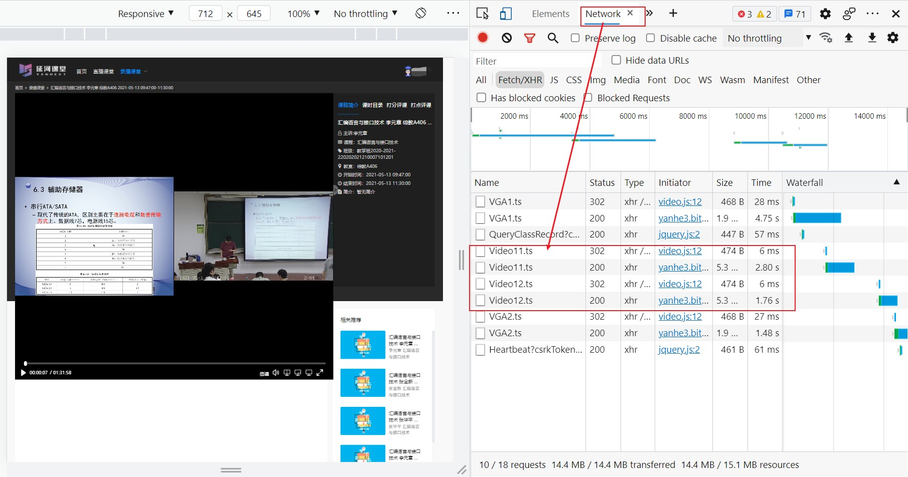
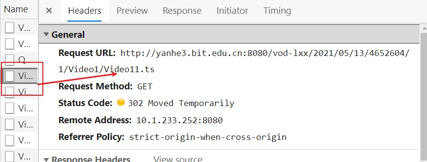
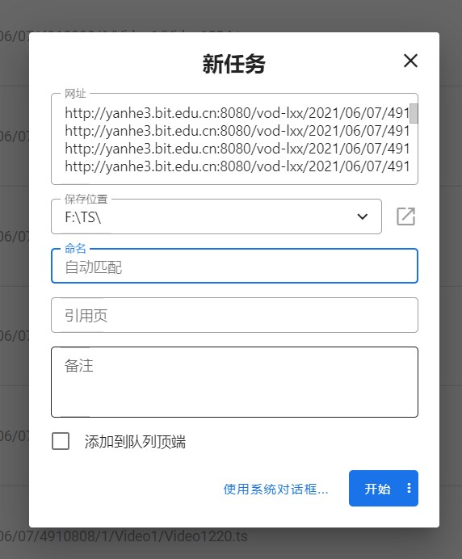
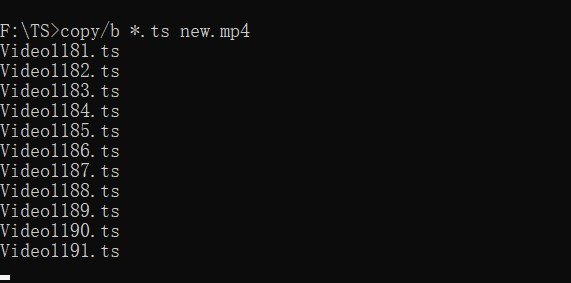

学校的课程在延河课堂都有录播，但是延河课堂的视频时不时会卡顿，如果能将视频下载到本地就好了。遗憾地是，延河课堂不提供下载视频的功能。

经过一段时间观察，我找到一个办法下载延河课堂的视频。

## 找到视频资源的请求链接

在视频播放时按 F12 打开控制台，在 network 部分找到视频的请求链接，可以看到视频是一个个 .ts 文件，当文件快要播放完成时，又继续请求 .ts 文件



点击请求后在 header 部分可以看到请求链接



## 2 批量下载 .ts 文件

视频编号是有顺序的，所以找到视频开始的序号，视频结束的序号，我们可以用代码生成视频分割成的所有 .ts 文件

我这里使用 node.js 生成资源链接，你也可以随便用一种语言，一个循环就可以搞定这个事情。

```js
var fs = require("fs");

for (var i = 1008; i <= 1225; i++) {
  var url = `http://yanhe3.bit.edu.cn:8080/vod-lxx/2021/06/07/4910808/1/Video1/Video${i}.ts\n`;
  fs.appendFile("./test.txt", url, function (error) {
    if (error) {
      console.log(error);
    }
  });
}
```

为了用这些链接批量下载文件，可以为 chrome 浏览器装一个 chrono 下载管理器，它可以批量导入链接



## 合并 .ts 文件变成 mp4 文件

下载完成后，打开命令提示符窗口，到达文件的指定位置。

我们可以通过如下命令将所有的 .ts 文件合并为一个 mp4 文件：

```
copy/b *.ts new.mp4
```



至此，大功告成。
