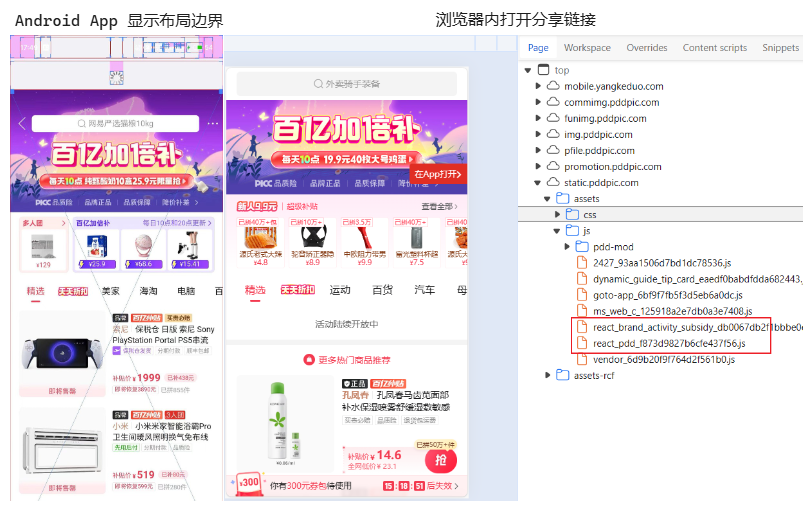
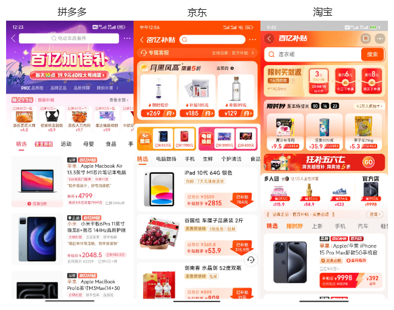
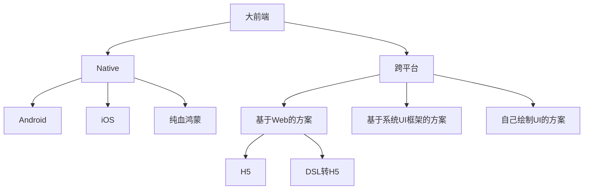
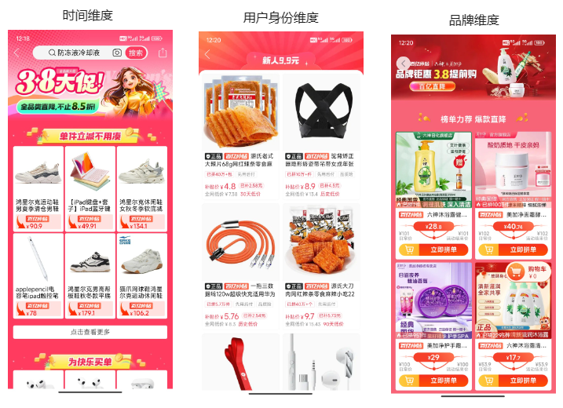
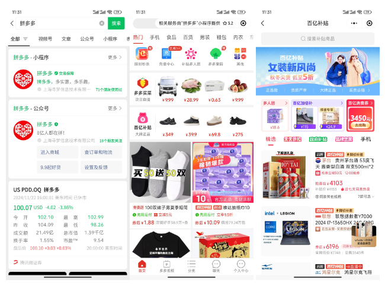
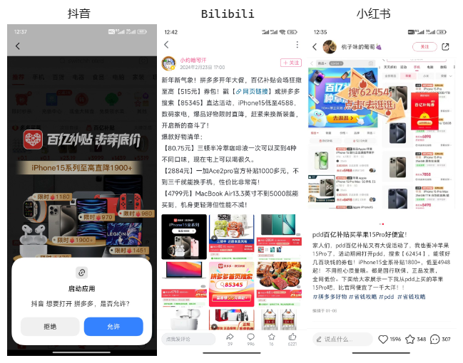
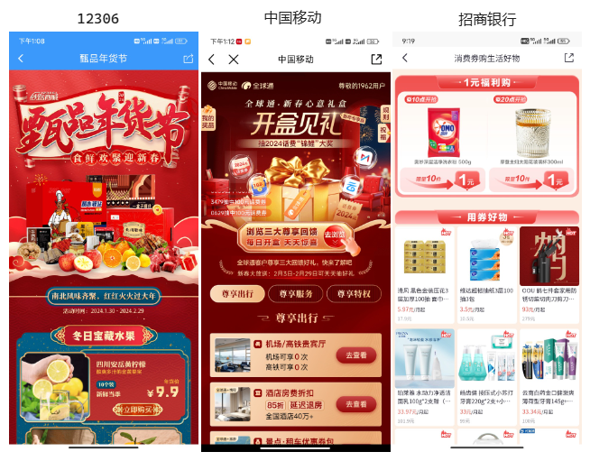
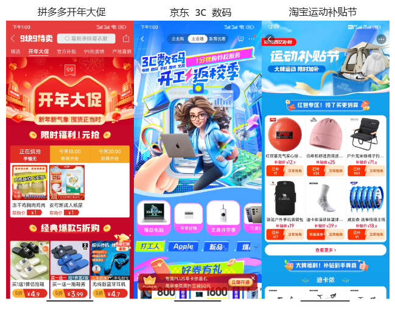

# 百亿补贴为什么用 H5？H5 未来会如何发展？

23 年 11 月末，拼多多市值超过了阿里。我想写一篇《百亿补贴为什么用 H5》，没有动笔；24 年新年，我想写一篇《新的一年，H5 会如何发展》，也没有动笔。

眼看着灵感烂在手里，我决定把两篇文章合为一篇，与你分享。提前说明，我不是百亿补贴的开发人员，本文纯属推测。

拳打 H5，脚踢小程序。我是「小霖家的混江龙」，关注我，带你了解更多实用的 H5、小程序武学。

## 我的证据

你可以在 Android 开发者模式下，开启显示布局边界，可以看到「百亿补贴」是一个完整大框，说明「百亿补贴」在 App 内是 H5；拷贝分享链接，在浏览器打开，可以看到资源中有 react 名字的 js 文件，说明「百亿补贴」技术栈是 React。

不只是拼多多，如果你去确认，会发现京东、淘宝的的「百亿补贴」技术栈也是 H5。

那么，为什么电商巨头会选择 H5 做「百亿补贴」的技术栈呢？

## 我的推理逻辑

解答这个问题前，我需要说明自己的推理逻辑。

基于结果去推测原因，我们会遇到一个问题，那就是多个原因都可以解释结果，应该选择哪一个？

我的标准是，选择具有**排他性**的原因。

什么是排他性？

举个例子，你问成功人物为什么成功，如果我回答「成功人士会喝水」，你肯定不满意。如果我回答「成功人士坚持不懈」，你会更满意一些。因为「喝水」不具备排他性，普通人也会喝水、「坚持不懈」具备排他性，普通人容易放弃。

解答百亿补贴为什么用 H5，我的推理逻辑是，**找到排他性的证据，说明百亿补贴只有 H5 能干，其他技术栈不能干**。

## 百亿补贴为什么用 H5？

粗略来看，大前端的技术栈 Native 和跨平台两个大类，前者包括 3 小类，分别是 Android、iOS、纯血鸿蒙；后者也包括三小类，分别是基于 Web 的方案、基于系统 UI 框架的方案（比如 React Native）、自己绘制 UI 的方案（比如 Flutter）。

其中，基于 Web 的方案，又可以细分为纯 H5 和 DSL 转 H5（比如 Taro）。

下面我们来排除掉除 H5 外的其他方案。

### 原因一：百亿补贴迭代频繁

百亿补贴的业务形式，是一个常住 H5，搭配上多个流动 H5。（「常住」和「流动」是我借鉴「常住人口」和「流动人口」造的词）

- 常住 H5 链接保持不变，方便用户二次访问。
- 流动 H5 链接位于常住 H5 的不同位置，方便分发用户流量。

具体到拼多多，它至少有 3 个流量的分发点，可点击的头图、列表上方的活动模块和侧边栏，3 者可以投放不同链接。下图分别投放了 3.8 女神节链接、新人链接和品牌链接：

每到一个节日、每换一个品牌，「百亿补贴」就需要更新一次。

为了满足快速频繁的迭代，框架必须快速开发、快速部署、一次开发多端复用。因此可以排除掉 Native 技术栈，只保留动态化技术栈。

### 原因二：百亿补贴需要投放小程序、其他 App

如图所示，百亿补贴需要在拼多多微信小程序中投放，这让 React Native 和 Flutter 一只脚踏进了棺材。

因为社区虽然有方案让 React Native、Flutter 适配小程序，但并不成熟，不适合用到生产项目中。

此外，百亿补贴的广告在抖音、B 站和小红书都有投放，这直接钉死了 React Native 和 Flutter 的棺材板。

至此，除了基于 Web 的方案，其他方案都可以排除。

### 原因三：百亿补贴核心流量是 APP，而不是小程序

现在我们只剩下了基于 Web 的两种技术方案。H5 和 DSL 转出来的 H5（比如 Taro）。

百亿补贴的 HTML 结果，更符合原生 H5 的组织结构，而不是 Taro 这种 DSL 转出来的结构，我想到的原因是。

如果核心流量在小程序，会用 DSL 转成小程序代码，转成 H5 只是填补其他小流量的空缺。如果核心流量在 APP，小程序是小流量，那么一般会把 H5 嵌入到小程序的 Webview 内。

**综上所述，迭代频繁、需要投放小程序、其他 App，核心流量是自己的 App，是百亿补贴选择 H5 的原因。**

## H5 未来会如何发展

了解「百亿补贴」选择 H5 的原因后，我们来看看电商巨头对 H5 未来发展的影响。我认为有三个影响：

### SSR 比例增加

选择了 H5 的同时，获得 H5 好处的同时，也有 H5 的缺陷。

为提升 H5 的秒开率接入 SSR，因此 SSR 的比例会增加。

### 定制化要求苛刻

C 端用户黏性相对较低，换一个 App 的成本微不足道。近年 C 端市场增长缓慢，企业重点从获取更多的新客变成留住更多的老客，很难容忍用户丢失。因此其他企业投放活动 H5 时，企业必须也投放活动 H5，电商活动 H5 就变得越来越多。

这个膨胀的趋势不仅仅存在于互联网巨头的 App 中，中小型应用也不例外，甚至像 12306、中国移动、招商银行这种工具性极强的应用也无法幸免。

随着市场的竞争加剧，定制化要求也变得越来越苛刻，目的是让消费者区分各种活动。用互联网黑话来说，就是「建立用户心智」。在可预见的未来，尽管电商活动 H5 结构基本相同，但是它们的外观将变得千差万别、极具个性。

## 总结

本文介绍了我认为「百亿补贴」会选用 H5 的 3 大原因：

- 百亿补贴迭代频繁
- 百亿补贴需要投放小程序、其他 App
- 百亿补贴核心流量是自己的 App

以及电商巨头对 H5 产生的 2 个影响：

- SSR 比例增加
- 定制化要求苛刻

拳打 H5，脚踢小程序。我是「小霖家的混江龙」，关注我，带你了解更多实用的 H5、小程序武学。
