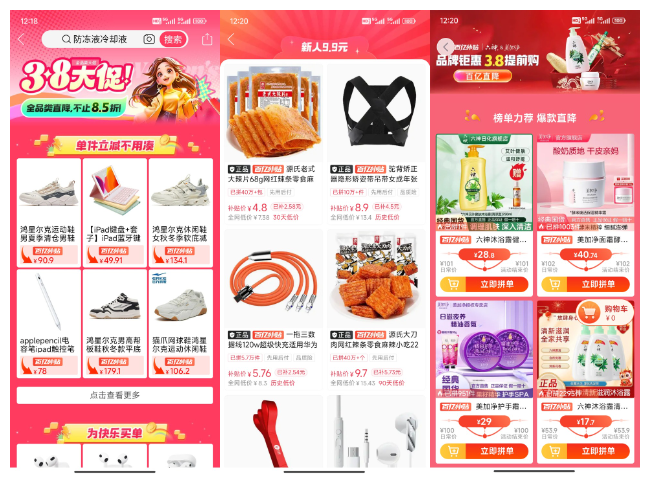

# 百亿补贴为什么用 H5？H5 未来会如何发展？

23 年 11 月末，拼多多市值超过了阿里。我想写一篇《百亿补贴为什么用 H5》，没有动笔；24 年新年，我想写一篇《新的一年，H5 会如何发展》，也没有动笔。

眼看着灵感烂在手里，我决定把两篇文章合为一篇，与你分享。提前说明，我并非百亿补贴的开发人员，本文的内容是我的推理。

拳打 H5，脚踢小程序。我是「小霖家的混江龙」，关注我，带你了解更多实用的 H5、小程序武学。

## 我的证据

在 Android 开发者模式下，开启显示布局边界，你可以看到「百亿补贴」是一个完整大框，这说明「百亿补贴」在 App 内是 H5。拷贝分享链接，在浏览器打开，可以看到资源中有 React，说明「百亿补贴」技术栈是 React。

不只是拼多多，利用同样的方法，你可以发现京东、淘宝的「百亿补贴」技术栈也是 H5。

那么，为什么电商巨头会选择做「百亿补贴」时会选择 H5 呢？

## 我的推理逻辑

解答问题前，我先说明下推理逻辑。巨头可能选择 H5 的原因千千万万，但最有说服力的原因，肯定具有**排他性**。

什么是排他性？

举个例子，成功人物为什么成功，如果我回答「成功人士会喝水」，你肯定不满意。如果我回答「成功人士坚持不懈」，你会更满意一些。喝水分明是成功人士成功的原因，不喝水人会渴死，没办法成功。你为什么对这个答案不满意呢？

因为「喝水」不具备排他性，普通人也会喝水；而「坚持不懈」比「喝水」更具排他性，大部分普通人没有这个特质。

按照排他性，我需要说明**百亿补贴只有 H5 能干，其他技术栈不能干**，这样才有说服力。

## 百亿补贴为什么用 H5？

现在进入正题。粗略来看，大前端的技术栈分为 Native 和跨平台两大类。前者包括 3 小类，分别是 Android、iOS、纯血鸿蒙；后者也包括 3 小类，分别是基于 Web 的方案、基于系统 UI 框架的方案（比如 React Native）、自己绘制 UI 的方案（比如 Flutter）。

其中，基于 Web 的方案，又可以细分为纯 H5 和 DSL 转 H5（比如 Taro）。

我们需要排除 H5 外的其他方案。

### 原因一：百亿补贴迭代频繁

百亿补贴的业务形式，是一个常住 H5，搭配上多个流动 H5。（「常住」和「流动」是我借鉴「常住人口」和「流动人口」造的词）

- 常住 H5 链接保持不变，方便用户二次访问。
- 流动 H5 链接位于常住 H5 的不同位置，方便分发用户流量。

具体到拼多多，它至少有 3 个流量的分发点，可点击的头图、列表上方的活动模块和侧边栏，3 者可以投放不同链接。下图分别投放了 3.8 女神节链接、新人链接和品牌链接：

可以想到，几乎每到一个节日、每换一个品牌，「百亿补贴」就需要更新一次。

这样频繁的迭代，框架必须满足快速开发、快速部署、一次开发多端复用条件。因此可以排除掉 Native 技术栈，留下动态化技术栈。

### 原因二：百亿补贴需要投放小程序和其他 App

如图所示，你可以在微信上搜索拼多多，可以看到百亿补贴不仅在 App 上投放，还在微信小程序里投放。

此时我们几乎可以排除掉 React Native 和 Flutter 技术栈。因为社区虽然有方案让 React Native、Flutter 适配小程序，但并不成熟，不适合用到生产项目中。

此外，如果你在抖音、B 站和小红书搜索百亿补贴，你可以看到百亿补贴在这些 App 上都有投放广告。

这点可以完全排除 React Native 和 Flutter 技术栈。据我所知，目前没有主流 App，会愿意让第三方在自己的 App 里运行 React Native 和 Flutter。

### 原因三：百亿补贴核心流量在 APP

现在只剩下了基于 Web 的 2 种技术方案，也就是 H5 和 DSL 转出来的 H5（比如 Taro）。

百亿补贴的 HTML 结果，更符合原生 H5 的组织结构，而不是 Taro 这种 DSL 转出来的结构。

我对此的解释是，百亿补贴的核心流量在 App。核心流量在 APP 时。投放小程序是锦上添花，把 H5 嵌入到小程序 Webview 就能满足要求，不需要卷性能。

如果百亿补贴的核心流量在小程序，那么大概率就会使用 DSL 框架，转出来小程序代码和 H5 代码。

**综上所述，迭代频繁、需要投放小程序和其他 App，核心流量在 App，是百亿补贴选择 H5 的 3 个主要原因。**

## H5 未来会如何发展

知道百亿补贴选择 H5 的 3 个原因后，我们可以得到结论，如果 3 个前提不变，未来很长一段时间内，H5 依然是电商活动的主流方案。

不过，主流方案并不意味着一成不变，我认为未来 H5 会有 2 个发展趋势：

### 趋势一：离线包、SSR 比例增加

H5 有诸多优势的同时，也有着先天缺陷，那就是下载成功率低、容易白屏。

解决这个问题，社区主流的两个方案是离线包和 SSR。

离线包可以将网页的静态资源（如 HTML、CSS、JS、图片等）缓存到本地，用户访问 H5 页面时，可以直接读取本地的离线资源，从而提升页面的加载速度。[阿里云](https://help.aliyun.com/document_detail/178947.html)和[腾讯云](https://cloud.tencent.com/document/product/1034/64737)等云服务商都有自己的离线包方案。

SSR 即服务器端渲染，它可以减少白屏时间，让用户更快看到页面。传统的 CSR（客户端渲染）初始时只渲染空白的 HTML 框架，然后再去获取数据并渲染内容。而在 SSR 中，服务器在接收到客户端请求时，会在服务器端利用数据和模板生成完整的 HTML 页面，再把页面发送给客户端浏览器。

不难想到，业务陷入瓶颈后，企业开始看中性能，大部分前端开发者都会来卷一卷离线包、 SSR，它们的比例会进一步增加。

### 趋势二：定制化要求苛刻

近年 C 端市场增长缓慢，企业重点从扩张新客，变成留存老客。

这个背景下，定制化要求变得越来越苛刻，目的是让用户区分各种活动。用互联网黑话来说，就是「建立用户心智」。

下面是拼多多、京东、淘宝、12306、中国移动和招商银行的活动 H5，尽管它们结构都差不多，但长得是千奇百怪。

我估计未来，电商活动 H5 的外观将变得极具个性，各位前端同学可以在卷卷 CSS、动效方向。

## 总结

本文介绍了我认为「百亿补贴」会选用 H5 的 3 大原因：

- 百亿补贴迭代频繁
- 百亿补贴需要投放小程序、其他 App
- 百亿补贴核心流量是自己的 App

以及我 H5 未来发展趋势的 2 个预测：

- 离线包、SSR 比例增加
- 定制化要求苛刻

拳打 H5，脚踢小程序。我是「小霖家的混江龙」，关注我，带你了解更多实用的 H5、小程序武学。
