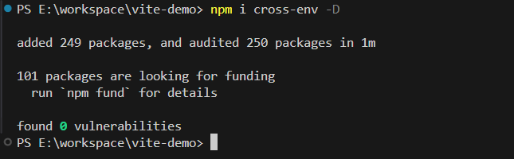

# 对比静态替换和动态插入标签，Vite 打包 H5 注入版本号哪种方式更优雅？

日常维护 H5 时，你可能有一个诉求，在 H5 发布时带上版本号。这样发现报错时，版本号可以辅助你排查错误；上线优化措施时，版本号可以辅助你观测性能……

本文我会告诉你 Vite 在 H5 注入版本号的两种方式，并对比它们的优劣。

拳打 H5，脚踢小程序。我是「小霖家的混江龙」，关注我，带你了解更多实用的 H5、小程序武学。

## 静态替换和动态插入标签

- 静态替换，利用 Vite 的 .env 文件和 `import.meta.env` 对象，打包时直接替换 js 代码、Vue 模板中的变量
- 动态插入标签，利用 Vite 插件和 `tansformIndexHtml` 钩子，打包时往 HTML 里插入标签

为了方便理解，下面演示这两种方法。首先用 Vite 新建一个 Demo，出于习惯我这里直接选择了 React，你也可以选择 Vue。


## 静态替换的流程

静态替换主要分为三个步骤：

1. 在 .env 文件写入变量
2. 在 js 代码中替换变量
3. 上报版本号给监控 SDK

### 在 .env 文件写入变量

需要注意的是，**只有以 VITE_ 为前缀的变量才会暴露给经过 vite 处理的代码**。你可以把版本号命名为 `Vite_H5_VERSION`。

```
VITE_H5_VERSION=0.0.1
```

### 在 js 代码中替换变量

你可以在 vite 需要处理的代码中，直接使用 `import.meta.env.VITE_H5_VERSION`。比如在 main.jsx 中直接打印它。

这样编译后，`import.meta.env.VITE_H5_VERSION` 会被自动替换。如下图所示，第三个文件是编译后的 js，可以看到变量已经被替换为版本号。


### 上报版本号给监控 SDK

现在，你要做的就是把版本号上传到监控平台。我们以阿里云的 ARMS npm 包为例子：

```js
const BrowserLogger = require('alife-logger')

const __bl = BrowserLogger.singleton({
 pid: 'xxx',
 // ARMS 配置应用版本号
 release: import.meta.env.VITE_H5_VERSION,
 // ... 省略
});
```

## 动态插入标签的流程

动态插入标签也主要分为三个步骤：

1. 从命令行读取版本号
2. 插入版本号到 HTML
3. 上报版本号给监控 SDK

### 从命令行读取版本号

Windows、Linux 和 Mac 系统，在命令行设置临时环境变量的写法不同，你可以在安装 cross-env 这个开发依赖。它可以让你在不同系统使用相同方式注入环境变量（比如版本号）。



安装依赖后，你可以运行如下命令。它的作用是往 process-env 里注入变量 H5_VERSION，并执行打包。

```bash
npx cross-env H5_VERSION=0.0.1 npm run build
```

你可以直接在 vite.config.js 中打印读取到的版本号：

```js
import { defineConfig } from 'vite'
import react from '@vitejs/plugin-react'

console.log('H5_VERSION is ', process.env.H5_VERSION)

// https://vite.dev/config/
export default defineConfig({
  plugins: [react()],
})
```

可以看到，当运行 build 命令时，在 vite.config.js 内部已经读取到了 H5_VERSION。


下面，你需要把版本号插入到 HTML 中。

### 插入版本号到 HTML

你可以使用一个 vite 官方插件钩子函数 [transformIndexHtml](https://vitejs.cn/vite3-cn/guide/api-plugin.html#transformindexhtml) 编写一个插件，它可以替换 HTML 的内容，也可以插入 js 脚本。

插件代码如下，transformIndexHtml 函数返回了一个对象，对象包括 html 和 tag 两个属性。不难看出，这个对象的意思就是，在 head 标签靠前的位置插入一个 script 标签，标签内容是 `window.$H5_VERSION="0.0.1"`。

```js
import { defineConfig } from 'vite'
import react from '@vitejs/plugin-react'

function injectVersion () {
  return {
    name: 'inject-version',
    transformIndexHtml(html) {
      return {
        html,
        tags: [
          {
            injectTo: 'head-prepend',
            tag: 'script',
            children: `window.$H5_VERSION = "${process.env.H5_VERSION}"`
          }
        ]
      }
    }
  }
}

export default defineConfig({
  plugins: [react(), injectVersion()],
})
```

你可以再次启动打包，就能看到 dist 的产物中已经有了插入版本号的脚本。


### 上报版本号给监控 SDK

因为版本号脚本在 head 标签最顶层，会最早执行，所以你之后在 HTML、React 中都可以用 `window.$H5_VERSION` 获取版本号。

现在，你要做的就是把版本号上传到监控平台。

以阿里云的错误监控 ARMS 为例，你可以在它初始化 SDK 时给 release 取值 `window.$H5_VERSION`。

```html
<!DOCTYPE html>
<html>
  <!-- ... 省略 -->
  <body>
    <script>
      !(function (c, b, d, a) {
        c[a] || (c[a] = {})
        c[a].config = {
          pid: 'xxx',
          // ARMS 配置应用版本号
          release: window.$H5_VERSION,
          // ... 省略
        }
        // ... 省略
      })(window, document, 'xxx.js', '__bl')
    </script>
    <!-- ...省略 -->
  </body>
</html>
```

## 总结

|  | 静态替换 | 动态插入标签 |
| -- | -- | -- |
| **读入变量方式** | 从 .env 文件读入 | 从命令行读取 |
| **替换变量方式** | 利用 vite 替换 | 利用插入标签替换 |
| **使用变量的地方** | vite 处理后的 js 文件 | html、js 均可 |

总结来看，动态插入标签，可以在 HTML 里使用变量，对 cdn 引入的 js、npm 包引入的 js 使用都很友好，我认为这是一种更优雅的方式。

拳打 H5，脚踢小程序。我是「小霖家的混江龙」，关注我，带你了解更多实用的 H5、小程序武学。
