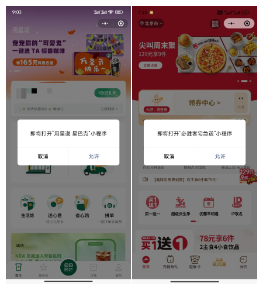
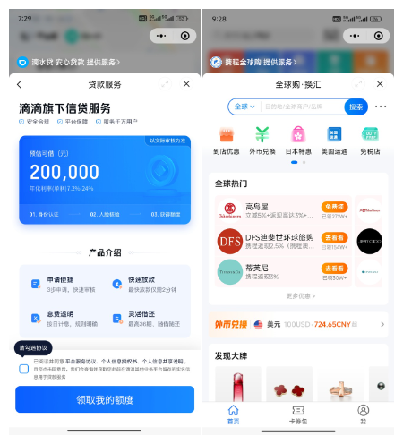
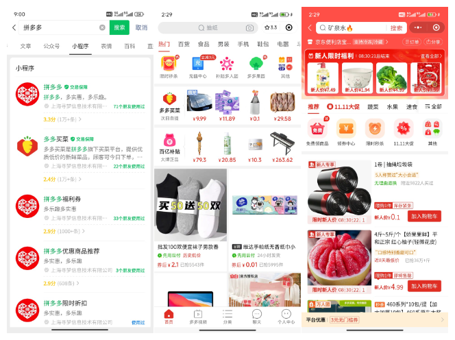
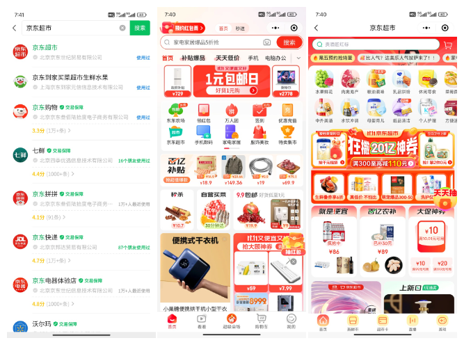

# H5 套 H5 叫微前端，那么小程序套小程序呢？

## 打开另一个小程序

[打开另一个小程序 | 微信官方文档](https://developers.weixin.qq.com/miniprogram/dev/api/navigate/wx.navigateToMiniProgram.html)

## 打开半屏小程序

[打开半屏小程序 | 微信官方文档](https://developers.weixin.qq.com/miniprogram/dev/framework/open-ability/openEmbeddedMiniProgram.html)

## 打开子包

