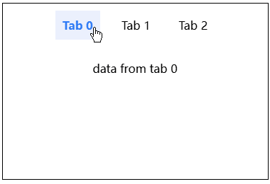

# H5 先发出的请求后返回，应该怎么办？—— 请求竞态问题

在 H5 开发中，遇到 Tab List 场景时，我们常常会遇到一个问题，那就是先发出的请求，可能之后返回，这个问题会导致 Tab 和列表的值不一致。

如下动图所示，你从 Tab 0 依次快速切换的 Tab 2，又从 Tab 2 快速切换到 Tab 0，最终虽然选择的是 Tab 0，但是 List 的数据却是 Tab 2。




这其中的原因，虽然 List 2 的数据发送得比较早，但是返回却比较晚，于是就覆盖了之前 List 0 和 List 1 的数据。

你可以用 setTimeout 模拟请求不固定的情况：

```js
let currentIndex = 0;

function switchTab(tabIndex) {
  // ... 省略
}

function fetchData(tabIndex) {
  setTimeout(() => {
    const data = `data from tab ${tabIndex}`;
    updateList(data);
  }, Math.random() * 3000);
}

function updateList(data) {
  // ... 省略
}
```

完整代码在：https://codepen.io/lijunlin2022/pen/eYqLjpo

可以看到，我们给 setTimout 随机设置了不同的返回时间，用来模拟不同时间的请求。

这种因为请求时间不固定，导致数据不一致的问题，被称作请求竞态问题。

下面我介绍 3 种解决问题的办法，并对它们做一个优劣做一个对比。

拳打 H5，脚踢小程序。我是「小霖家的混江龙」，关注我，带你了解更多实用的 H5、小程序武学。

## 取消请求

第一种方法是取消请求，它的思路很简单，那就是我只用我最后一次发出请求的数据，以前的数据我都不要。

我们之前用 setTimeout 模拟了不同时间的请求，也可以用 clearTimeout 模拟取消请求：

关键代码如下：

```js
let currentIndex = 0;
let timer = null

function switchTab(tabIndex) {
  // ... 省略
}

function fetchData(tabIndex) {
  clearTimeout(timer);
  timer = setTimeout(() => {
    const data = `data from tab ${tabIndex}`;
    updateList(data);
  }, Math.random() * 5000);
}

function updateList(data) {
  // ... 省略
}
```

可以看到，我让所有 setTimeout 共用了一个计时器，一旦有新的 setTimeout，就把旧的给清除掉。

完整代码在：codepen: https://codepen.io/lijunlin2022/pen/mdNzbWy

这种清除的方法，XMLHttpRequest 和 fetch 都提供了。

XMLHttpRequest 的取消请求

```js
const xhr= new XMLHttpRequest();

xhr.open('GET', 'https://xxx');
xhr.send();
    
xhr.abort(); // 取消请求
```

fetch 可以取消请求

```js
const controller = new AbortController();
const signal = controller.signal;

fetch('/xxx', {
  signal,
}).then(function(response) {
  //...
});

controller.abort(); // 取消请求
```

axios 也能够取消请求

```js
const source = axios.CancelToken.source();

axios.get('/xxx', {
  cancelToken: source.token
}).then(function (response) {
  // ...
});

source.cancel() // 取消请求
```

需要注意的是，这里的取消请求，只是前端不再使用这个请求的数据，发到后端的请求是没有变少的。

但是按照我的经验，实际项目中，网络请求总是被封装封装再封装，而取消请求往往会被遗漏掉，此时想要再去改代码非常困难。下面我们再介绍另外两种方法，它们更简单和实用。

## 忽略请求

这种做法，就是处理请求给它一个标识，如果请求结果回来之后我们发现标识对不上，那么就忽略这个请求，关键代码如下：

```js
let currentIndex = 0;

function switchTab(tabIndex) {
  currentIndex = tabIndex;
  // ... 省略
}

function fetchData(tabIndex) {
  setTimeout(() => {
    const data = `data from tab ${tabIndex}`;
    updateList(tabIndex, data);
  }, Math.random() * 5000);
}

function updateList(tabIndex, data) {
  const list = document.getElementById("list");
  if (tabIndex === currentIndex) {
    list.innerHTML = data;
  }
}
```

我们在切换 Tab 时更新了 currentIndex，同时我们还把 tabIndex 一起传递给了 fetchData，如果后来我们反向请求结束后的 tabIndex 和我们的 currentIndex 不匹配时，我们就忽略这次请求。

完整代码如下：

codepen: https://codepen.io/lijunlin2022/pen/MWNPgGG

## 映射请求

接下来我们映射请求。我们回到出现问题的初始条件，除了先发出的请求后返回之外，出现这个问题的另一个核心原因是多个 Tab 只使用了一个 List，如果我们让一个 Tab 对应一个 List，就可以解决这个问题。

不过，虽然能够有多个 List，但页面上只能显示一个，因此我们还需要给选中 Tab 的 List 加上 display: block，其他 List 都是 display: none

```html
<main>
  <div id="tabs">
    <div class="tab active" onclick="switchTab(0)">Tab 0</div>
    <div class="tab" onclick="switchTab(1)">Tab 1</div>
    <div class="tab" onclick="switchTab(2)">Tab 2</div>
  </div>
  <div id="lists">
    <div class="list active">data from tab 0</div>
    <div class="list"></div>
    <div class="list"></div>
  </div>
</main>
```

```js
let currentIndex = 0;

function switchTab(tabIndex) {
  // ... 省略
}

function fetchData(tabIndex) {
  setTimeout(() => {
    const data = `data from tab ${tabIndex}`;
    updateList(tabIndex, data);
  }, Math.random() * 5000);
}

function updateList(tabIndex, data) {
  const lists = document.getElementById("lists");
  Array.from(lists.children).forEach(l => {
    l.classList.remove("active")
  })
  lists.children[tabIndex].classList.add("active")
  lists.children[tabIndex].innerHTML = data
}
```

这种方法也很有效，但维护多个 List 的难度比维护单个 List 要困难，所以大部分人不会采用，不过如果能和第二种结合的话，是一种非常不错的减少请求次数的办法。

完整代码为：codepen: https://codepen.io/lijunlin2022/pen/KKOGPEo

## 总结

我们介绍了什么事请求竞态问题，并给出了三种解决方案。

其中忽略请求最实用，映射请求在缓存数据时很好用，而取消请求则需要更高超的使用方法。

拳打 H5，脚踢小程序。我是「小霖家的混江龙」，关注我，带你了解更多实用的 H5、小程序武学。