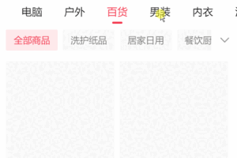

# 从快速切换 Tab 说起，先发出的请求后得到结果（请求竞态问题）如何解决？

开发 H5 的朋友或许都遇到过一个问题。场景如下，页面有一个 Tab，然后 Tab 下方有对应的商品列表：

我们快速切换 Tab，会偶然发现 Tab 选项的商品不符合预期，比如最终选项是「男装」，但商品却还是「食品」。

这是因为切换 Tab 时，我们会先发送「食品」的请求、再发送了「男装」的请求，但是由于网络速度等原因，接口先返回了「男装」的响应，再返回了「食品」的响应。

