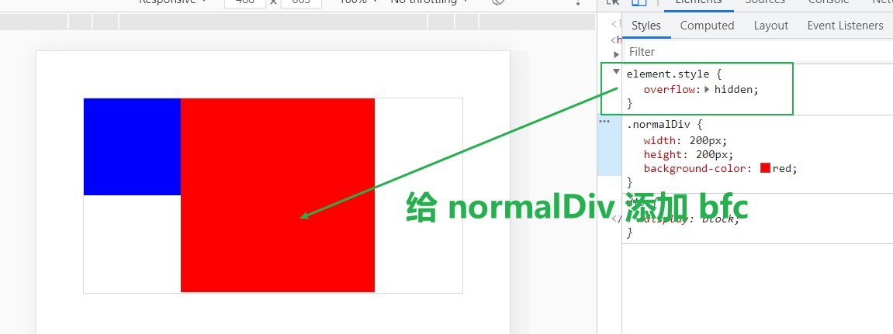

# bfc

BFC 全称 Block Format Context，即块级格式化上下文。BFC 可以看作一种规范，具有这种规范的元素可以看作一块独立的渲染区域，这块区域的元素不会影响边界之外的元素。

它的特性为：

1. BFC 是独立容器，容器内部元素不会影响容器外部元素
2. BFC 内的元素在垂直方向上依次排列
3. 同一个 BFC 内部的两个相邻容器的上下 margin 会重叠
4. **BFC 的区域不会与浮动容器发生重叠**
5. **计算 BFC 区域高度时, 浮动元素也参与计算**

## 触发 BFC 的条件

1. 根元素 (`<html>`)
2. 元素的 `float` 不是 `none`
3. 元素的 `position` 为 `absolute` 或 `fixed`
4. `overflow` 的值不等于 `visible`
5. `contain` 的值为 `layout`、`content` 或 `paint` 的元素
6. `display` 为 `inline-block`、`table-cell`、`flex`、`inline-flex`、`grid` 等

## BFC 的作用

- 避免外边距重叠

比如，下面的代码原本的 margin 是要纵向重叠的：

```html
<style>
.cube {
    width: 100px;
    height: 100px;
    background: blue;
    margin: 100px;
}
</style>

<div class="cube"></div>
<div class="cube"></div>
```

修改后外边距不再重叠：

```html
<style>
.cube {
    width: 100px;
    height: 100px;
    background: blue;
    margin: 100px;
}
.bfc {
    overflow: hidden;
}
</style>

<div class="bfc">
    <div class="cube"></div>
</div>
<div class="bfc">
    <div class="cube"></div>
</div>
```

- 经典的清除浮动方法之一

给元素设置浮动，会使元素脱离标准流，造成父元素高度坍塌。BFC 会将浮动的高度计算到父元素高度内，从而达到清除元素的效果。

原本造成浮动的代码如下：

```html
<style>
.container {
    border: 1px solid red;
}
.float-left {
    float: left;
}
.cube {
    width: 100px;
    height: 100px;
    background: blue;
}
</style>

<div class="container">
    <div class="cube float-left"></div>
</div>
```

修改后为：

```html
<style>
.container {
    border: 1px solid red;
}
.float-left {
    float: left;
}
.cube {
    width: 100px;
    height: 100px;
    background: blue;
}
.bfc {
    overflow: hidden;
}
</style>

<div class="container bfc">
    <div class="cube float-left"></div>
</div>
```

**清除浮动，bfc 加在父元素部分**

- 阻止元素被浮动元素覆盖

假设代码如下：

```html
<style>
.container {
    border: 1px solid #ddd;
}
.floatDiv {
    width: 100px;
    height: 100px;
    background-color: blue;
    float: left;
}
.normalDiv {
    width: 200px;
    height: 200px;
    background-color: red;
}
</style>

<div class="container">
    <div class="floatDiv"></div>
    <div class="normalDiv"></div>
</div>
```

floatDiv 脱离标准流后会遮挡 normalDiv，效果如下


添加 bfc 之后，效果如下图：


