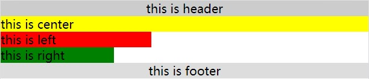
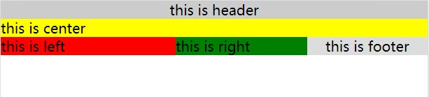
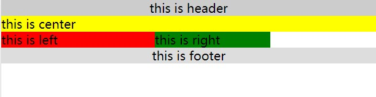
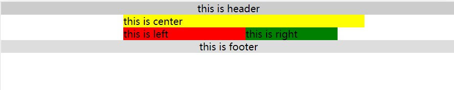
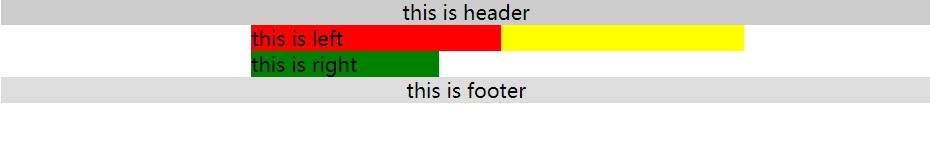
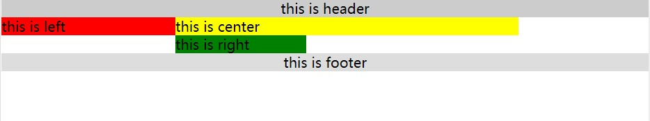
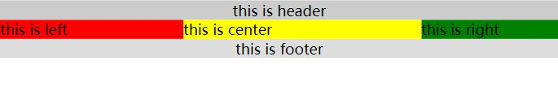

# 圣杯布局

圣杯布局的样式为：

- 三栏布局，中间一栏最先加载和渲染（内容最重要）
- 两侧内容固定，中间内容随着宽度自适应
- 一般用于 PC 网页

圣杯布局的技术总结：

- 使用 float 布局
- 两侧使用 margin 负值，以便和中间内容横向重叠
- 防止中间内容被两侧覆盖，会使用 padding 为两侧预留位置

下面开始一步步实现圣杯布局

## 最初的 DOM 元素和 CSS 样式

html 结构结构如下，**center 在 left 和 right 之上**：

```html
<div id="header">this is header</div>
<div id="container">
  <div id="center">this is center</div>
  <div id="left">this is left</div>
  <div id="right">this is right</div>
</div>
<div id="footer">this is footer</div>
```

css 结构如下，**body 必须有 min-width**

```css
body {
  min-width: 550px;
}
* {
  padding: 0;
  margin: 0;
}
#header {
  text-align: center;
  background-color: #ccc;
}
#center {
  background-color: yellow;
  width: 100%;
}
#left {
  background-color: red;
  width: 200px;
}
#right {
  background-color: green;
  width: 150px;
}
#footer {
  text-align: center;
  background-color: #ddd;
}
```

效果为：



## 添加浮动

为 center, left 和 right 添加类 column，在类 column 的 css 中添加浮动：

```html
<div id="container">
  <div id="center" class="column">this is center</div>
  <div id="left" class="column">this is left</div>
  <div id="right" class="column">this is right</div>
</div>
```

```css
.column {
  float: left;
}
```

效果为：



## 清除浮动

上一节中让 center 之后的子元素全部浮动了起来，而 footer 应该保持在底部，所以要清除浮动：

```css
#footer {
  clear: both;
  text-align: center;
  background-color: #ddd;
}
```

效果为：



## 通过 padding 让 center 留出空位给 left 和 right

给 container 设置 padding-left 和 padding-right，其中，padding-left 等于 left 的宽度，padding-right 等于 right 的宽度

```css
#container {
  padding-left: 200px;
  padding-right: 150px;
}
```

效果为：



## 给 left 设置 margin-left 负值，让 left 和 center 的左端重叠

由于是浮动，可以认为 center 的右边直接连接着 left

margin-left 负值会让元素左移，如果左移 center 的长度，就能够让 left 和 center 的左端重叠

```css
#left {
  margin-left: -100%;
  background-color: red;
  width: 200px;
}
```

效果为：



## 相对定位让 left 到达左边空出的位置

为了让 left 向左移动，可以使用相对定位，移动的长度就是 left 的长度

```css
#left {
  position: relative;
  right: 200px;
  margin-left: -100%;
  background-color: red;
  width: 200px;
}
```

效果为：



## 给 right 设置 margin-right 负值，让 right 到达右边空出的位置

margin-right 负值，会让 right 后面的元素左移，原因时 margin-right 取负值后会影响其他元素对 right 宽度的判断

如果 margin-right 取的负值恰好为 right 的宽度，则在 center 看来，right 已经没有了宽度，因此可以直接跟在自己后面

```css
#right {
  margin-right: -150px;
  background-color: green;
  width: 150px;
}
```

效果为：


