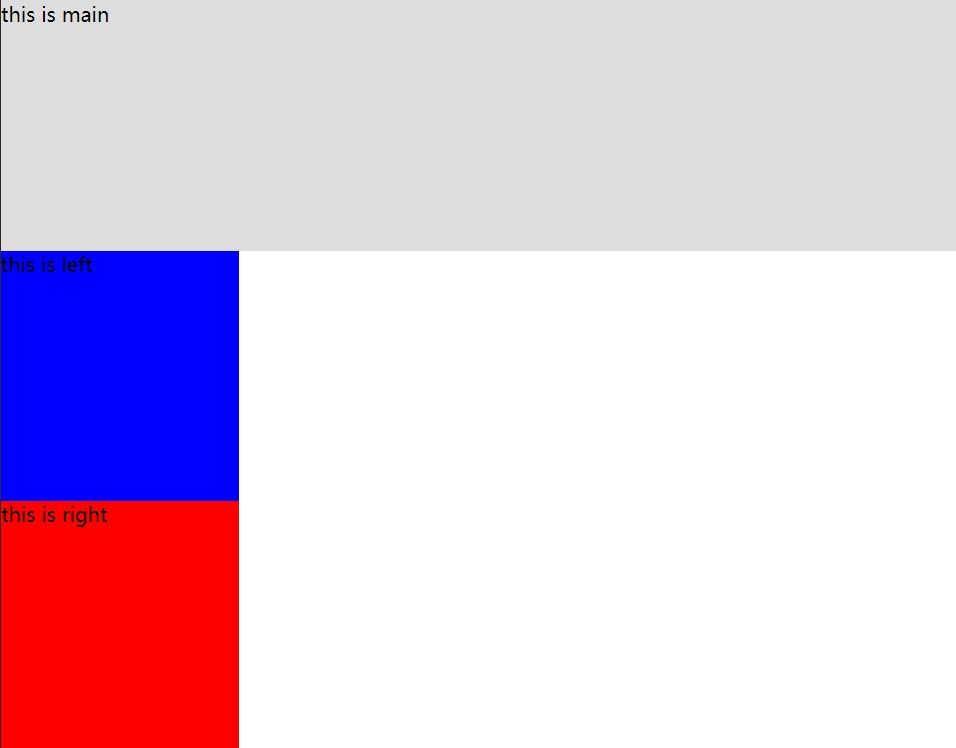
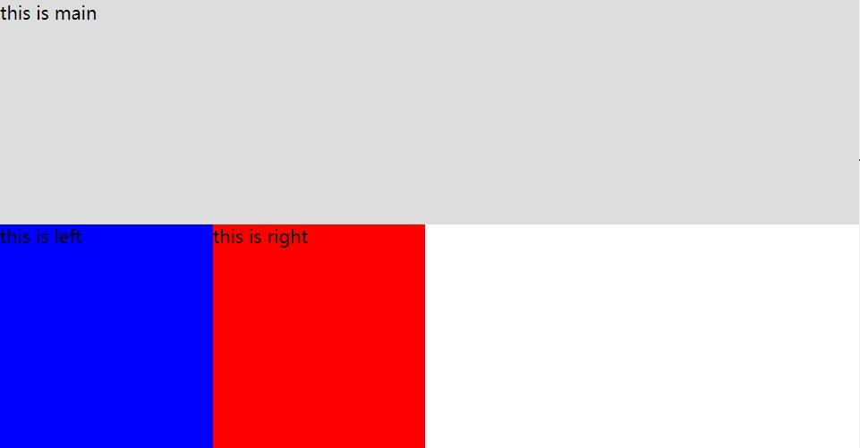
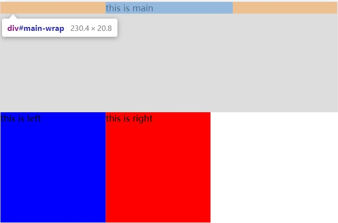
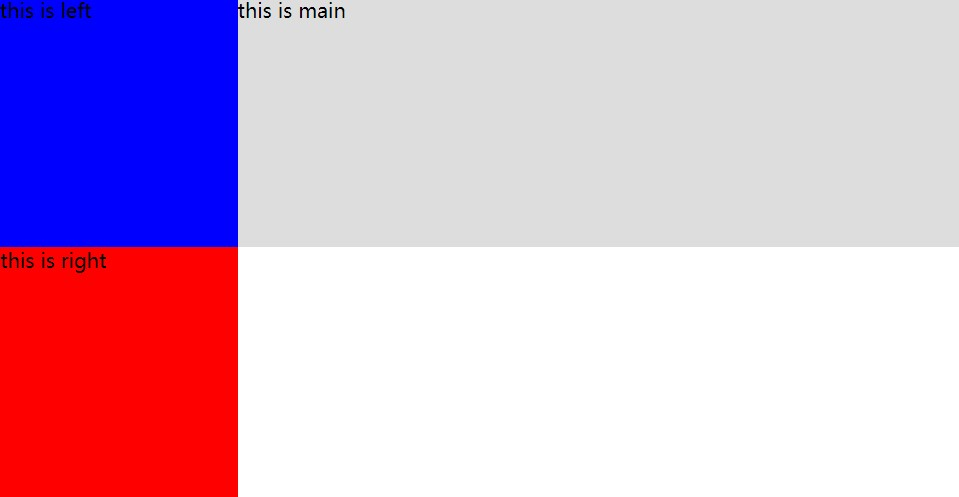
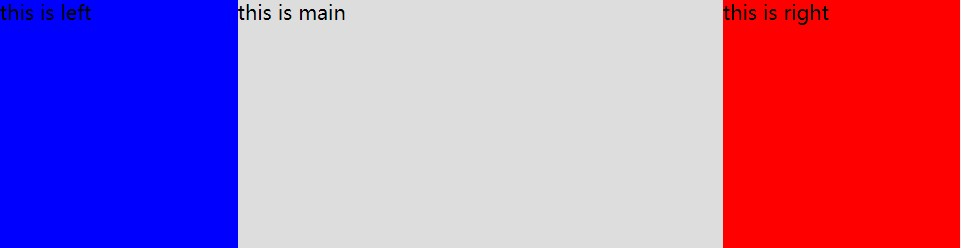

# 双飞翼布局

双飞翼布局与圣杯布局的样式一样，都是：

- 三栏布局，中间一栏最先加载和渲染（内容最重要）
- 两侧内容固定，中间内容随着宽度自适应
- 一般用于 PC 网页

双飞翼的技术总结：

- 使用 float 布局
- 两侧使用 margin 负值，以便和中间内容横向重叠
- 防止中间内容被两侧覆盖，会使用 margin 为两侧预留位置

下面开始一步步实现双飞翼布局

## 最初的 DOM 元素和 CSS 样式

html 结构如下，**main 在 left 和 right 之上**，**main 中还有 main-wrap**：

```html
<div id="main">
  <div id="main-wrap">
    this is main
  </div>
</div>
<div id="left">
  this is left
</div>
<div id="right">
  this is right
</div>
```

css 结构如下：**body 中必须有 min-width**：

```css
* {
  padding: 0;
  margin: 0;
}

body {
  min-width: 550px;
}

#main {
  width: 100%;
  height: 200px;
  background-color: #ddd;
}

#left {
  width: 190px;
  height: 200px;
  background-color: blue;
}

#right {
  width: 190px;
  height: 200px;
  background-color: red;
}
```

效果为：



## 添加浮动

为 main，left 和 right 添加类 column，在类 column 的 css 中添加浮动：

```html
<div id="main" class="column">
  <div id="main-wrap">
    this is main
  </div>
</div>
<div id="left" class="column">
  this is left
</div>
<div id="right" class="column">
  this is right
</div>
```

```css
.column {
  float: left;
}
```

效果为：



## 通过 margin 让 main-wrap 留出空位给 left 和 right

```css
#main-wrap {
    margin: 0 190px 0 190px;
}
```

由于只是留出空位，效果并不明显：



## 给 left 设置 margin-left 负值，让 left 移动到指定空位

left 取的 margin 负值是 `-100%`:

```css
#left {
  margin-left: -100%;
  width: 190px;
  height: 200px;
  background-color: blue;
}
```

效果为：



## 给 right 设置 margin-left 负值，让 right 移动到指定位置

```css
#right {
  margin-left: -190px;
  width: 190px;
  height: 200px;
  background-color: red;
}
```

效果为：


