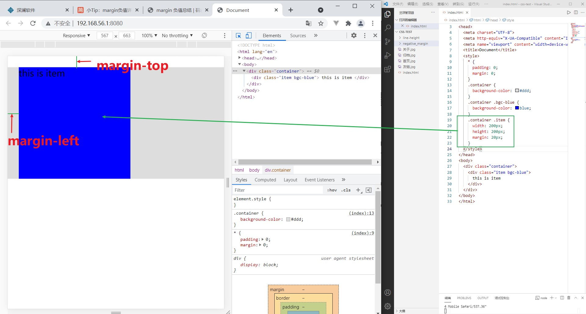
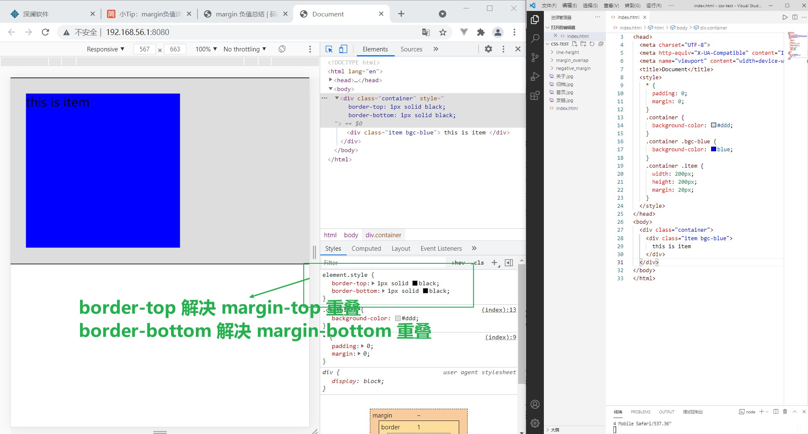
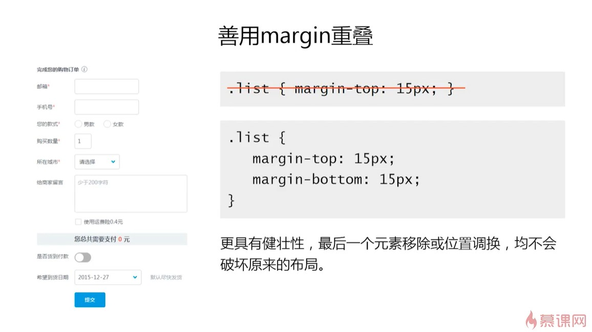

# margin 坍塌/重叠

margin 纵向重叠一般有三种情形：

- 相邻的兄弟元素 margin 重叠
- 父级和第一个/最后一个子元素重叠
- 空的 block 元素重叠

其中，相邻的兄弟元素 margin 重叠是典型情况，就不再介绍

## 父级和第一个/最后一个子元素重叠

请先看一个例子，图中的 `margin-left` 可以撑开父元素，但是 `margin-top` 却没有撑开父元素，这就是父元素与子元素的 margin 重叠



如果给父元素添加 `border-top` 就可以解决 `margin-top` 的重叠问题，给父元素添加 `border-bottom` 就可以解决 `margin-bottom` 的重叠问题



## 形成 `margin-top` 重叠的原因

1. 父元素非块状格式化上下文（BFC）元素
2. 父元素没有 `border-top` 设置
3. 父元素没有 `padding-top` 设置
4. 父元素和第一个子元素之间没有 `inline` 元素分割

## 形成 `margin-bottom` 重叠的原因

1. 父元素非块状格式化上下文（BFC）元素
2. 父元素没有 `border-top` 设置
3. 父元素没有 `padding-top` 设置
4. 父元素和第一个子元素之间没有 `inline` 元素分割
5. 父元素没有 `height`, `min-height` 和 `max-height` 的限制

## 空的 block 元素重叠

请看一道试题：

```html
<!-- 如下代码, AAA 和 BBB 之间的巨鹿是多少? -->
<style>
 p {
  font-size: 16px;
  line-height: 1;
  margin-top: 10px;
  margin-bottom: 15px;
 }
</style>

<p>AAA</p>
<p></p>
<p></p>
<p></p>
<p>BBB</p>
```

- 相邻元素的 margin-top 和 margin-bottom 会发生重叠
- 空白内容的 `<p></p>` 也会重叠
- 答案：15px

这就是空的 block 元素重叠

## 空 block 元素重叠的条件

1. 元素没有 border 设置
2. 元素没有 padding 设置
3. 元素里面没有 inline 元素
4. 元素没有 height, 或者 min-height

## margin 重叠的计算

可以用三句口诀总结

- 正正取大值
- 正负值相加
- 负负最负值

## margin 重叠的应用


