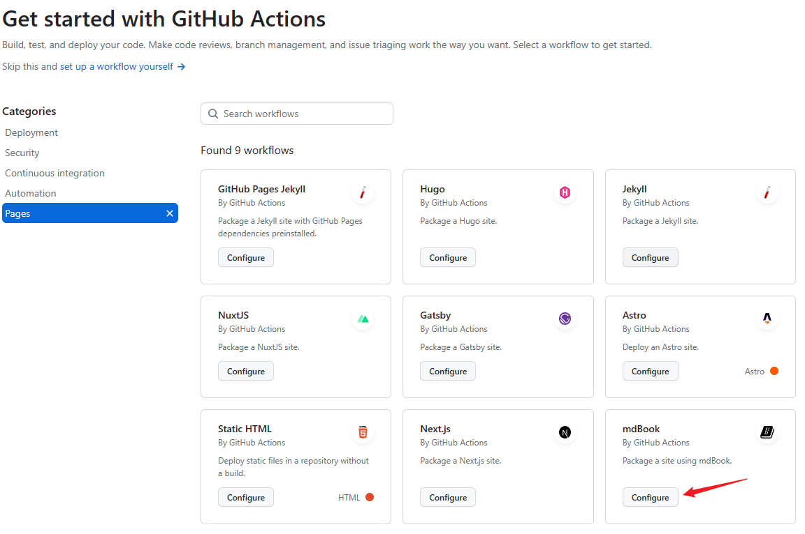
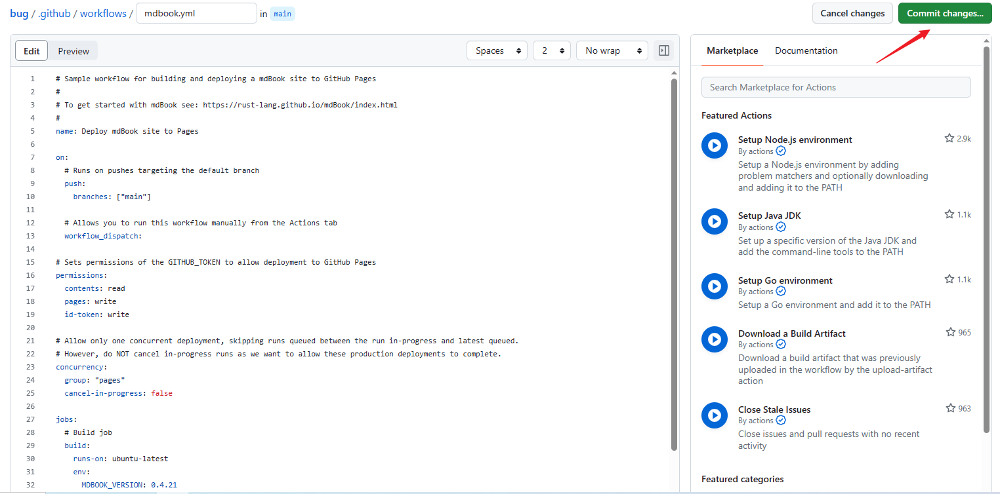

# mdbook

## GitHub Pages

通过使用 GitHub Actions 的 workflow（工作流）的模板，我们可以快速部署网站到 github.io 域名下。

1. GitHub 仓库中，选择 Settings -> Pages -> GitHub Actions -> browse all workflows


2. 点击 Pages 右侧的 View all 按钮


3. 选择 mdBook，点击 Configure 按钮



4. 之后 GitHub 会自动创建一个 yml 文件



5. 我们可以将整个仓库克隆到本地，按照 [mdBook 官方指南](https://rust-lang.github.io/mdBook/) 的指导书写 Markdown 文件。当我们提交后，会自动触发 GitHub Actions 将网站部署到 GitHub Pages 下。

## GitHub Issues

mdBook 本身并不支持评论，但我们可以使用 [utterances](https://utteranc.es/) 这个评论插件，很方便快捷地添加评论功能。

1. 在 GitHub 新建一个用于评论的仓库。比如我单独新建了一个 [blog-issues](https://github.com/lijunlin2022/blog-issues)
2. 访问 [utterances 的配置界面](https://github.com/apps/utterances) ，点击 `Configure`，然后选择用于评论的仓库。
3. 在 mdBook 的 Markdown 文件底部，加入一段 script 代码。我们只需要填写 `repo`（仓库名）和 `issue-term`（issue 分组，可以直接写文章名）。

```html
<script
  src="https://utteranc.es/client.js"
  repo="lijunlin2022/blog-issues"
  issue-term="mdbook-github-issues"
  theme="github-light"
  crossorigin="anonymous"
  async
>
</script>
```

## 中文搜索

mdBook 生成的文档和书记，默认只支持英文搜索，其实我们只需要几个简单的配置，就可以让 mdBook 生成的 HTML 支持中文搜索。

1. 新建一个和 src 同级的文件夹 assets。
2. 将 [fzf.umd.js](https://gist.github.com/lijunlin2022/1a9d90b078422192b51392c92e3a9dba) 和 [elasticlunr.js](https://gist.github.com/lijunlin2022/1a9d90b078422192b51392c92e3a9dba) 文件放到 assets 目录下。
3. 在 book.toml 的配置中添加配置

```
[output.html]
additional-js = ["assets/fzf.umd.js", "assets/elasticlunr.js"]
```

## mermaid

mdbook 默认并不支持使用 mermaid 画图。我们可以通过安装插件的方式，让 mdbook 支持这个功能。

（1）安装 mdbook-mermaid

```
cargo install mdbook-mermaid
```

（2）在 book.toml 中可以添加如下配置。

```toml
[preprocessor.mermaid]
command = "mdbook-mermaid"

[output.html]
additional-js = ["assets/mermaid.min.js", "assets/mermaid-init.js"]
```

[mdbook-mermaid](https://github.com/badboy/mdbook-mermaid) 是一个开源插件。

（3）拷贝 mermaid 到与 src 同级的 assets 文件夹中。

mermaid-init.js 用来初始化 mermaid，内容为：

```js
mermaid.initialize({ startOnLoad: true });
```

至于 mermaid.min.js，可以去 [mermaid 官网](https://mermaid.js.org/)，找到它的 [CDN 地址](https://cdn.jsdelivr.net/npm/mermaid@10.2.0/dist/mermaid.min.js) 拷贝。

之后重新运行 `mdbook serve` 命令，就可以看到 mdbook 已经支持 mermaid 画图功能了。

(4) 更新部署脚本

如果你和我一样，使用的是 GitHub Pages 部署博客，那么你需要更改 yml。

```yml
jobs:
  # Build job
  build:
    runs-on: ubuntu-latest
    env:
      MDBOOK_VERSION: 0.4.21
    steps:
      - uses: actions/checkout@v3
      - name: Install mdBook
        run: |
          curl --proto '=https' --tlsv1.2 https://sh.rustup.rs -sSf -y | sh
          rustup update
          cargo install --version ${MDBOOK_VERSION} mdbook
          cargo install mdbook-mermaid
```

## 404

我们可以给网站设置 404 页面，这样当用户访问到网站不存在的链接时，会跳转到 404 页面，提高用户的体验。

默认情况下，mdBook 只需要在 src 目录下添加 404.md，404 页面便会显示 404.md 的内容。

我们也可以通过修改 book.toml 中的配置，改变 404 页面的路径：

```toml
[output.html]
input-404 = "404.md"
```

除此之外，我们还需要设置 site-url，site-url 一般设置为网站的根路径，确保 404 页面也能正常获取脚本和样式文件。

```toml
[output.html]
site-url = "https://lijunlin2022.github.io/blog/"
```

## sitemap

如果我们能够给搜索引擎提供 [sitemap.xml](https://developers.google.com/search/docs/crawling-indexing/sitemaps/build-sitemap?hl=zh-cn)，那么它抓取 mdbook 生成的网站就会更加快速。

目前 mdbook 没有提供生成 sitemap.xml 的插件，但是我们可以使用 node.js 的插件。

这里我选中了一款插件，名叫 [static-sitemap-cli](https://github.com/zerodevx/static-sitemap-cli)。

我们只需要简单的两个步骤，就可以生成自己的 sitemap.xml。

（1）安装 static-sitemap-cli

```
npm install static-sitemap-cli
```

（2）生成站点地图到 book 文件夹下

```
npx sscli --base https://lijunlin2022.github.io/blog/ -r book
```

这样便完成了。

不过，我的最终目的是，每当我有新博客提交时，都会自动更新 sitemap.xml 并部署，因此我需要改造一下原有的 yml 文件。

具体可以参考 [https://github.com/lijunlin2022/blog/blob/main/.github/workflows/mdbook.yml](https://github.com/lijunlin2022/blog/blob/main/.github/workflows/mdbook.yml)。

以我的博客为例，访问 [https://lijunlin2022.github.io/blog/sitemap.xml](https://lijunlin2022.github.io/blog/sitemap.xml) 便可以看到 sitemap.xml 文件了。