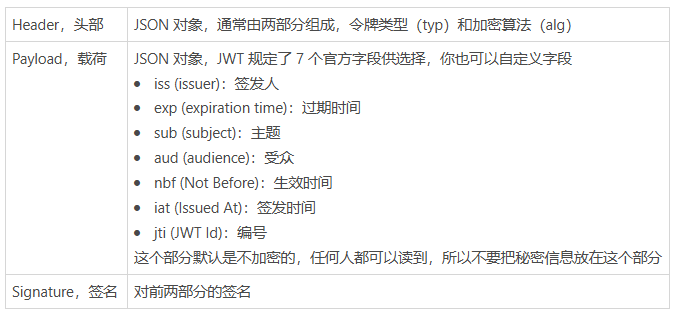

import { Tab, Tabs } from 'rspress/theme';

# 登录注册

## JSON Web Token 流程

一般流程：

1. 用户在客户端提供身份信息（一般是用户名和密码）
2. 服务器认证后，生成一个 JSON 对象，加密（防止用户篡改）后生成 Token 发给用户
3. 客户端将 Token 保存到本地
4. 客户端每次请求时将 Token 附加在请求头部
5. 服务器接到请求后，验证 Token 的有效性，并根据 Token 的信息进行授权



<Tabs>
<Tab value="服务器生成 Token" label="服务器生成 Token">
服务器生成的 Token 由三部分组成：


</Tab>
<Tab value="代码" label="代码">
```js
const jws = require('jws')

const config = {
  algorithm: 'HS256',
  secret: 'xxx'
}

module.exports.sign = async function (payload, exp) {
  const r = {
    iat: new Date().getTime() / 1000,
    exp,
    payload
  }

  const promise = new Promise((resolve, reject) => {
    jws.createSign({
      header: { alg: config.algorithm },
      secret: config.secret,
      payload: JSON.stringify(r)
    }).on('done', function (signature) {
      resolve(signature)
    })
  })

  return promise
}
```
</Tab>
</Tabs>

<Tabs>
<Tab value="服务器验证 Token" label="服务器验证 Token" default>
传入签名后，服务器利用自己保存好的秘钥解密，然后验证功能。
</Tab>
<Tab value="代码" label="代码">
```js
const jws = require('jws')

const config = {
  algorithm: 'HS256',
  secret: 'xxx'
}

module.exports.verify = function (signature) {
  const promise = new Promise((resolve, reject) => {
    jws.createVerify({
      algorithm: config.algorithm,
      secret: config.secret,
      signature
    }).on('done', function (verified, obj) {
      if (verified) {
        const r = JSON.parse(obj.payload)
        resolve(r)
      } else {
        reject()
      }
    })
  })

  return promise
}
```
</Tab>
</Tabs>

## JSON Web Token 优缺点

| 优点 | 缺点 |
| -- | -- |
| 有效使用 JWT，可以降低服务器查询数据库的次数 | 服务器不保存 session 状态，因此无法在使用过程中废止某个 token，或者更改 token 的权限。也就是说，一旦 JWT 签发了，在到期之前就会始终有效，除非服务器部署额外的逻辑。|
| | JWT 本身包含了认证信息，一旦泄露，任何人都可以获得该令牌的所有权限 |
