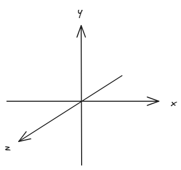
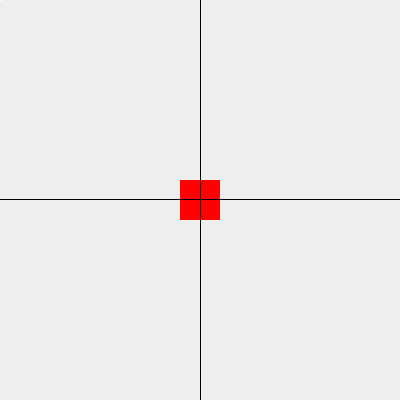

# 坐标系

webgl 的坐标系：



当 webgl 点的坐标是 (0.0, 0.0, 0.0, 1.0) 时，从二维来看，它位于中心。



为了可以随意地改变中心，我们可以使用顶点着色器中的 attribute 变量：

```js
const VERTEX_SHADER_SOURCE = `
  // 只用于顶点着色器, 默认是 vec4(0.0, 0.0, 0.0, 1.0)
  attribute vec4 aPosition;
  void main() {
    gl_Position = aPosition;
    gl_PointSize = 40.0;
  }
`
const FRAGMENT_SHADER_SOURCE = `
  void main() {
    gl_FragColor = vec4(1.0, 0.0, 0.0, 1.0);
  }
`

// 创建着色器
const program = initShader(gl, VERTEX_SHADER_SOURCE, FRAGMENT_SHADER_SOURCE)
const aPosition = gl.getAttribLocation(program, 'aPosition')
gl.vertexAttrib4f(aPosition, 0.0, 0.0, 0.0, 1.0) // 给变量赋值

// 执行绘制, 参数分别代表: 要绘制的图像, 开始位置, 使用几个顶点
gl.drawArrays(gl.POINTS, 0, 1)
```

