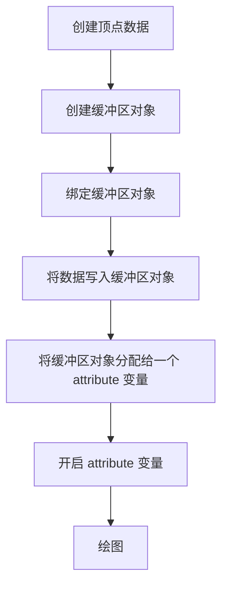
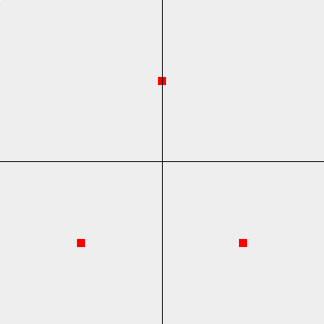

# 使用缓冲区对象绘制多个点

## 什么是缓冲区对象

缓冲区对象是 WebGL 系统中的一块**内存区域**，可以一次性向缓冲区对象内**填充大量的顶点数据**，然后将这些数据保存其中，给顶点着色器使用。



创建顶点数据：

```js
const points = new Float32Array([
  -0.5, -0.5,
  0.5, -0.5,
  0.0, 0.5
])
```

## 类型化数组

在 WebGL 中，需要处理大量的**相同类型的数据**，所以引入类型化数组，这样程序就可以与预知到数组中的数据类型，提高性能。

| 类型 | 说明 |
| -- | -- |
| Int32Array | 32 位整型 |
| UInt32Array | 32 位无符号整型 |
| Float32Array | 单精度 32 位浮点型 |
| Float64Array | 双精度 64 位浮点型 |

## 创建缓冲区对象

```js
const buffer = gl.createBuffer()
```

## 绑定缓冲区对象

```js
gl.bindBuffer(target, buffer)
```

- target，可以是如下两种
  - gl.ARRAY_BUFFER，表示缓冲区存储的是**顶点的数据**
  - gl.ELEMENT_ARRAY_BUFFER，表示缓冲区存储的是**顶点的索引值**
- buffer，已经创建好的缓冲区对象

## 将数据写入缓冲区对象

```js
gl.bufferData(target, data, type)
```

- target，类型同 `gl.bindBuffer` 中的 target
- data，写入缓冲区的顶点数据
- type，表示如何使用缓冲区对象中的数据，分为以下几类
  - gl.STATIC_DRAW，写入一次，多次绘制
  - gl.STREAM_DRAW，写入一次，绘制若干次
  - gl.DYNAMIC_DRAW，写入多次，绘制多次

## 将缓冲区对象分配给一个 attribute 变量

```js
gl.vertexAttribPointer(location, size, type, normalized, stride, offset)
```

- location，attribute 变量的存储地址
- size，没绘制一个顶点需要几个数据
- type，指定数据格式
  - gl.FLOAT，浮点型
  - gl.UNSIGNED_BYTE，无符号字节
  - gl.SHORT，短整型
  - gl.UNSIGNED_SHORT，无符号短整型
  - gl.INT，整型
  - gl.UNSIGNED_INT，无符号整型
- normalized，表示是否将数据归一化到 [0, 1] [-1, 1] 这个区间
- stride，两个相邻顶点之间的字节数
- offset，数据偏移量

## 开启 attribute 变量

```js
gl.enableVertexAttribArray(location)
```

有个对应的关闭 attribute 的方法 `gl.disableVertexAttribArray(aPosition)`。

```js
const canvas = document.getElementById('canvas')
const gl = canvas.getContext('webgl')

const VERTEX_SHADER_SOURCE = `
  attribute vec4 aPosition;
  void main() {
    gl_Position = aPosition;
    gl_PointSize = 10.0;
  }
`

const FRAGMENT_SHADER_SOURCE = `
  void main() {
    gl_FragColor = vec4(1.0, 0.0, 0.0, 1.0);
  }
`

// 创建着色器
const program = initShader(gl, VERTEX_SHADER_SOURCE, FRAGMENT_SHADER_SOURCE)
const aPosition = gl.getAttribLocation(program, 'aPosition')

const points = new Float32Array([
  -0.5, -0.5,
  0.5, -0.5,
  0.0, 0.5
])

const buffer = gl.createBuffer()
gl.bindBuffer(gl.ARRAY_BUFFER, buffer)
gl.bufferData(gl.ARRAY_BUFFER, points, gl.STATIC_DRAW)
gl.vertexAttribPointer(aPosition, 2, gl.FLOAT, false, 0, 0)
gl.enableVertexAttribArray(aPosition)
gl.drawArrays(gl.POINTS, 0, 3)
```

效果如下：


