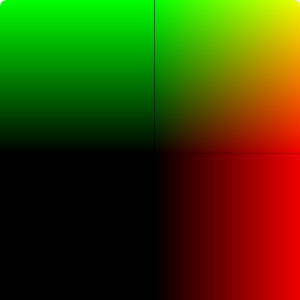

# varying 变量



关键 js 代码如下：

```js
const VERTEX_SHADER_SOURCE = `
  attribute vec4 aPosition;
  varying vec4 vColor;
  void main() {
    gl_Position = aPosition;
    vColor = aPosition;
  }
`

const FRAGMENT_SHADER_SOURCE = `
  precision lowp float;
  varying vec4 vColor;
  void main() {
    gl_FragColor = vColor;
  }
`
// ... 省略
```

varying 变量需要再顶点着色器和片元着色器同时设置。
