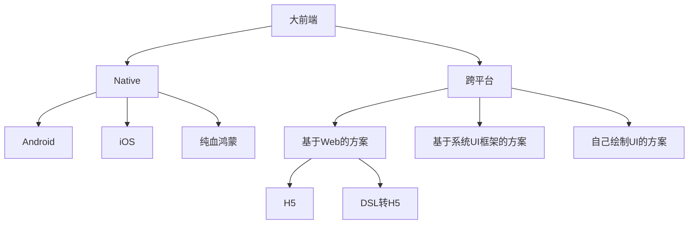

# 大纲

百亿补贴为什么用 H5？

声明：我不是百亿补贴的开发人员，本文是基于结果去推测原因。

思路：需要找到排他性的证据，也就是有一些事情只有 H5 能干，其他技术栈不能干。

分类：粗略来看，大前端的技术栈 Native 和跨平台两个大类，前者包括 3 小类，分别是 Android、iOS、纯血鸿蒙；后者也包括三小类，分别是基于 Web 的方案、基于系统 UI 框架的方案（比如 React Native）、自己绘制 UI 的方案（比如 Flutter）。

其中，基于 Web 的方案，又可以细分为纯 H5 和 DSL 转 H5（比如 Taro）。

原因一：百亿补贴迭代频繁，每当节假日时，就会推出新的活动。挑选的技术栈需要满足研发成本低、一次开发多端复用。排除掉 Native 技术栈

原因二：百亿补贴需要投放小程序。排除掉 React Native 和 Flutter。虽然社区也有方案让 React Native、Flutter 适配小程序，但方案并不成熟，不适合用到生产项目中。

原因三：百亿补贴核心流量是 APP，而不是小程序，排除掉 DSL 转 H5。

选 DSL 转 H5、还是直接 H5，大致有一个规律。

如果核心流量在小程序，会用 DSL 转成小程序代码，转成 H5 只是填补其他小流量的空缺。如果核心流量在 APP，小程序是小流量，那么一般会把 H5 嵌入到小程序的 Webview 内。

H5 未来会如何发展？

1、离线包、SSR 比例增加

2、定制化要求苛刻
