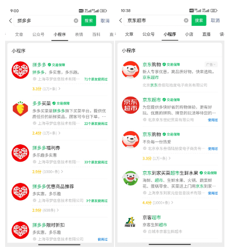
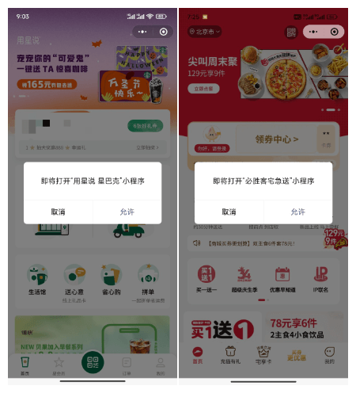
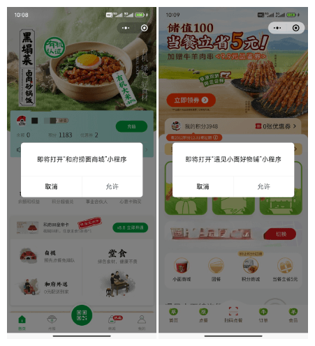
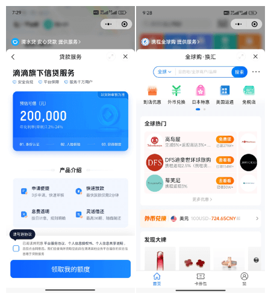
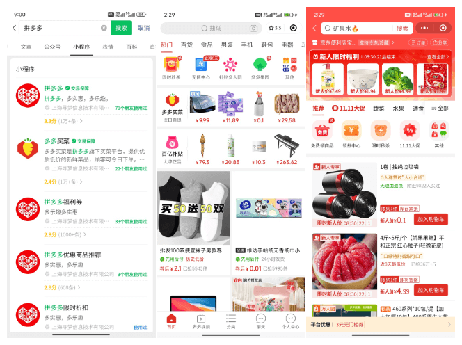
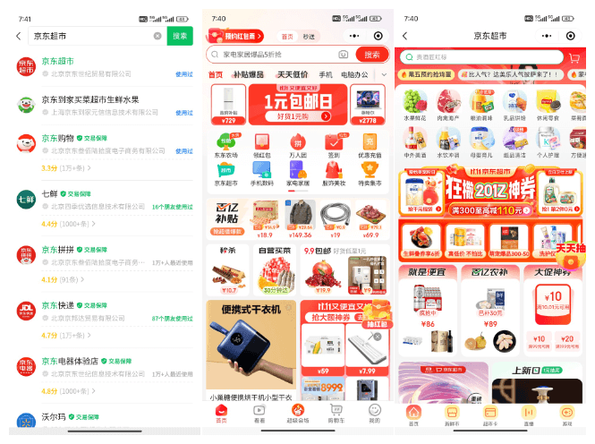

# 介绍小程序套小程序的三种方案，最后一种也许只有大厂才用

你在微信搜索小程序时，或许注意到很多企业都有一堆小程序，比如拼多多有"拼多多"、"多多买菜"……，京东有"京东超市"、"京东到家买菜生鲜水果"……

看到这么多小程序，你可能会一个很自然的想法，就是做一个核心的小程序，内部套壳其他的小程序。企业也正是这么做的，他们一般有三种方案，分别是"弹窗打开另一个小程序"、"半屏打开另一个小程序"和"分包打开另一个小程序"。

其中"分包打开另一个小程序"最复杂，也许只有大厂才会用这个方案。本文我会为你逐一介绍这三种方案。

拳打 H5，脚踢小程序。我是「小霖家的混江龙」，关注我，带你了解更多实用的 H5、小程序武学。

## 弹窗打开另一个小程序

第一种方案是"弹窗打开另一个小程序"。使用这个方案，打开其他小程序时，会出现一个提示弹窗。

星巴克打开"用心说 星巴克"、必胜客打开"必胜客宅急送"时，就用的这个方案。

这个方案官方 API 为 [wx.navigateToMiniProgram](https://developers.weixin.qq.com/miniprogram/dev/api/navigate/wx.navigateToMiniProgram.html) 。不难看出，该方案的缺点就是，显眼的弹窗容易导致用户流失。许多用户一看到这个弹窗，瞬间就丢失了查看下一个小程序的兴趣。

不过它的优点也非常明显。

1. 此种方案，官方没有限制打开小程序的数量。也就是说，一个小程序可以打开很多新的小程序；
2. 此种方案，打开的小程序功能不受限制。也就是说，新小程序可以再次用弹窗打开另一个小程序；
3. 此种方案，天生环境隔离。也就是说适配工作量很少。

综合优缺点，它最适合的场景，就是餐馆等需要用户坐在店铺里面的场景。因此很多餐馆点餐的小程序，都会用这种方案打开自己自带的商城小程序。

比如和府捞面会用弹窗打开"和府捞面商城"小程序，遇见小面会用弹窗打开"遇见小面好物铺"小程序。

## 半屏打开另一个小程序

第二种方案是"半屏打开另一个小程序"。它不会出现提示用户的弹窗，而是从小程序底部出现一个浮层，浮层占据大半个窗口，里面是另一个小程序。

滴滴打开滴水筹、携程打开换汇时，使用的就是这个方案。

这个方案的官方 API 为 [wx.openEmbeddedMiniProgram](https://developers.weixin.qq.com/miniprogram/dev/framework/open-ability/openEmbeddedMiniProgram.html)，不难看出，相比直接出现显眼的弹窗，这个方案的用户体验会更好。此外，它也是天生环境隔离，适配工作量很少。

不过它也有几个明显的缺陷：

1. 此种方案，不能打开个人主体的小程序；
2. 此种方案，有数量限制，按官方文档来看，一个小程序最多只能打开 10 个半屏小程序；
3. 此种方案，有功能限制。
   - 打开的半屏小程序，不能再打开新的半屏小程序；
   - 打开的半屏小程序，不能够二次分享。

我在日常接触的小程序中并不多，尚未总结出使用半屏小程序场景的共同规律。

## 分包打开另一个小程序

第三种方案是"分包打开另一个小程序"，它并不是官方提供的方案，而是开发者们研究出来的方案。

它的做法是，先把被嵌套的小程序打包成一个分包，然后以分包的方式，接入到核心小程序中。

拼多多的"多多买菜"和京东的"京东到家买菜生鲜水果"使用的就是这个方案。

我们先看拼多多，你可以点击搜索到的第一个"拼多多"小程序，在它的首页可以找到"多多买菜"的卡片，点击卡片，就可以看到"多多买菜"的页面。如果你点击的是第二个"多多买菜"小程序，你看到首页和刚才在"拼多多"小程序里看到的页面基本一模一样。

再看京东，你点击搜索到的第一个"京东超市"小程序，在它的首页可以找到"京东超市"选项，点击选项，就可以看到"京东超市"的页面。如果你点击的是第二个"京东到家买菜生鲜水果"小程序，你看到的首页和刚才在"京东超市"小程序里看到的页面基本一模一样。

这种方案的优点很明显，其一是用户无感知，流失量少；其二是没有功能的限制。

它的缺点也很明显，那就是需要强大的技术实力。需要开发者手动把一个小程序改造成分包的形式，还要想办法隔离两个小程序的环境。

我粗略估计，把一个小程序改造为分包，至少需要做三大改造。为了方便行文，我下面把需要改造为子包的小程序称为 B，把嵌套 B 的小程序称为 A。

1. 第一个改造是执行顺序改造。在改造之前，B 的执行顺序是先下载执行主包，再下载执行分包。但改造之后，B 的所有代码都是 A 的分包。假设 B 的主包被打包为分包 1，其他代码被打包为分包 2，那么在 A 执行分包 2 代码前，你需要保证分包 1 已经被执行；
2. 第二个改造是文件引用改造。改造之前，B 的 app.js 的公共逻辑、app.wxss 的公共样式，还有 app.json 中公共组件，都是代码里共用的。B 被打包为 A 的多个分包后，你需要保证在 A 中，每个分包都能用它原本的公共逻辑、公共样式和公共组件；
3. 第三个改造是状态改造。改造之前，你会在 B 里面用小程序的 globalData、Storage 共享数据，但是打包为 A 的子包后，你需要想办法把 B 的 globalData 和 Storage 做一个命名空间隔离。

至于其他的共享登录、共享定位，共享下单等优化，听起来更是复杂。或许只有大厂能设计并使用这种方案吧。

## 总结

本文我介绍了三种小程序套小程序的方案：

| 方案 |  API | 优点 | 缺点 |
| -- | -- | -- | -- |
| 弹窗 | wx.navigateToMiniProgram | 无数量限制、新小程序的功能不受限、天生隔离 | 用户体验差 |
| 半屏 | wx.openEmbeddedMiniProgram | 用户体验较好、天生隔离 | 个人主体无法使用、有数量限制、新小程序的功能受限制 |
| 分包 | 无 | 用户体验好，新小程序的功能不受限 | 技术难度大 |

拳打 H5，脚踢小程序。我是「小霖家的混江龙」，关注我，带你了解更多实用的 H5、小程序武学。

## 参考资料

- [wx.navigateToMiniProgram - 打开另一个小程序 | 微信官方文档](https://developers.weixin.qq.com/miniprogram/dev/api/navigate/wx.navigateToMiniProgram.html)
- [wx.openEmbeddedMiniProgram - 打开半屏小程序 | 微信官方文档](https://developers.weixin.qq.com/miniprogram/dev/framework/open-ability/openEmbeddedMiniProgram.html)
