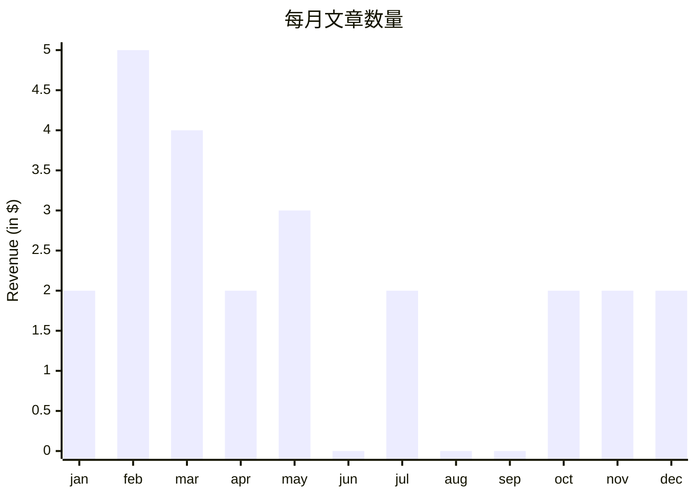
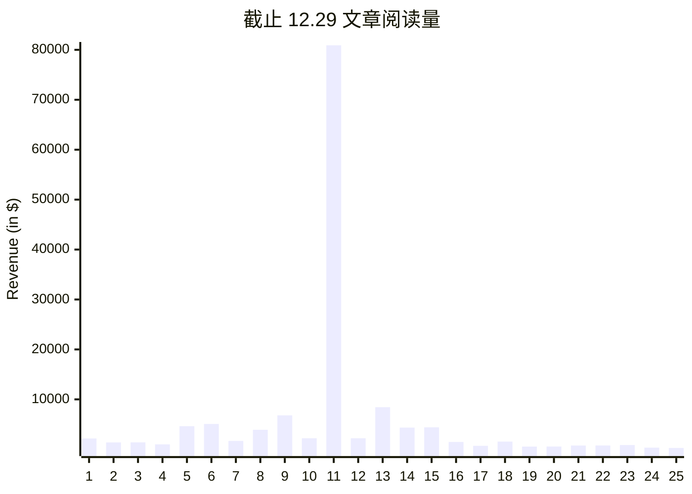
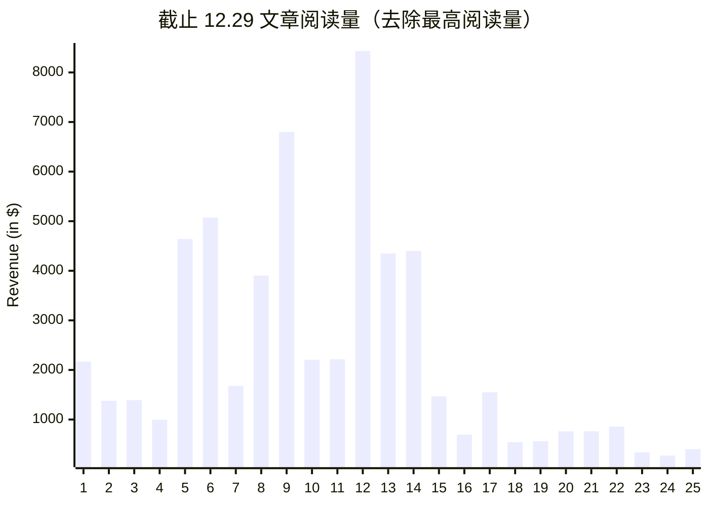

24 年就要结束了，写了一年的文章，总结下数据吧。

今年我写了 24 篇文章。2 月最多，有 5 篇；6、8、9 月最少，1 篇都没有。这一年不能算勤奋，也不算懒惰。

然后看下阅读量，截止目前，我阅读量最多的是[《百亿补贴为什么用 H5？H5 未来会如何发展？》](https://juejin.cn/post/7344325496983732250)，超过 8 万；阅读量最少的是[《小程序如何检测无流量组件？分享一种打点检测方法》](https://juejin.cn/post/7445927415157456931?searchId=20241229224045B64AB30888005CF4F730)，不到 300。

阅读量超过 8 万的文章，算是撞了大运，我平时没有这个水平，把它去除后数据如下：

可以看到，阅读量先增长，然后逐渐下跌。

我的阅读量能不能越来越多呢？我能继续坚持写文章吗？说实话我心里没底。
