本文介绍了如何在 Windows 10 下配置 IIS 服务器。这是北理工大二小学期相关内容，估计还能给学弟学妹们参考四五年。

## 配置 IIS

**搜索启用或关闭 Windows 功能**

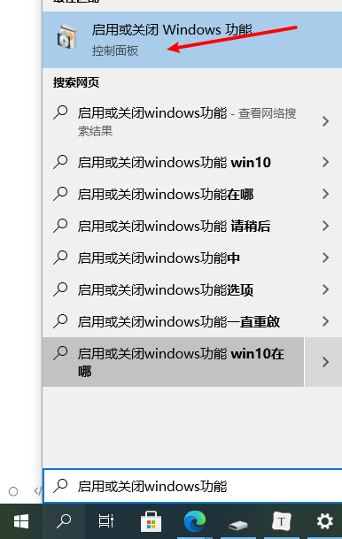

**点击展开 Internet Information Services**

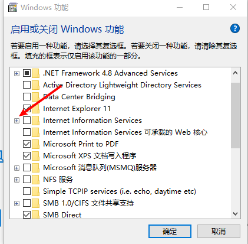

**勾选选项如图所示(黑色方块表示已选中)**，然后确认

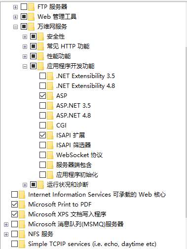

**搜索点击 IIS**

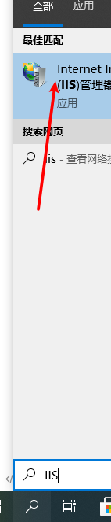

**添加网站**

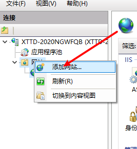

**配置网站**

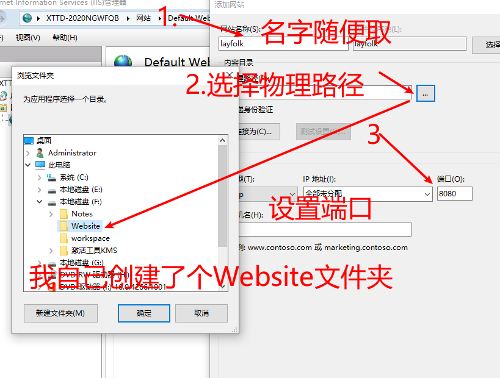

**在物理路径下创建 index.html 文件和 test.asp (修改txt文件得到)**

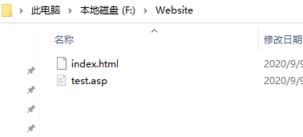

**在 iisstart.htm 中添加如下内容, 保存**

```html
<!DOCTYPE html>
<html>
  <head>
    <meta charset="UTF-8">
  </head>
  <body>
    默认把index.html当作入口
    <a href="../test.asp">跳转到test.asp</a>
  </body>
</html>
```

**在 test.app 中添加如下内容, 然后保存**

```asp
<html>
  <body>
    <%
      response.write("Hello World")
    %>
  </body>
</html>
```

**在浏览器输入 localhost:8080, 就可以看到如下界面**

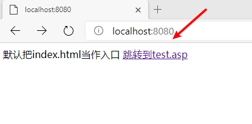

**链接可以跳转到 test.asp**

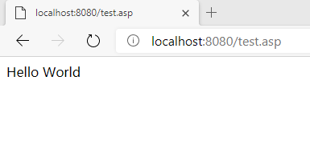

之后就可以在 Website 这个目录下放你写好的代码啦，

然后每次通过浏览器键入 localhost:8080 就可以直接访问 index.html

也可以之间键入 localhost:8080/test.asp 访问 test.asp

我放了一些培训时写的代码：

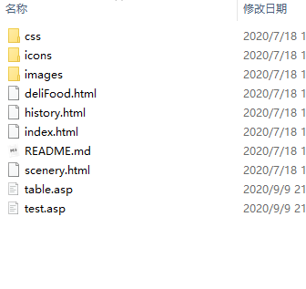

结果如下：

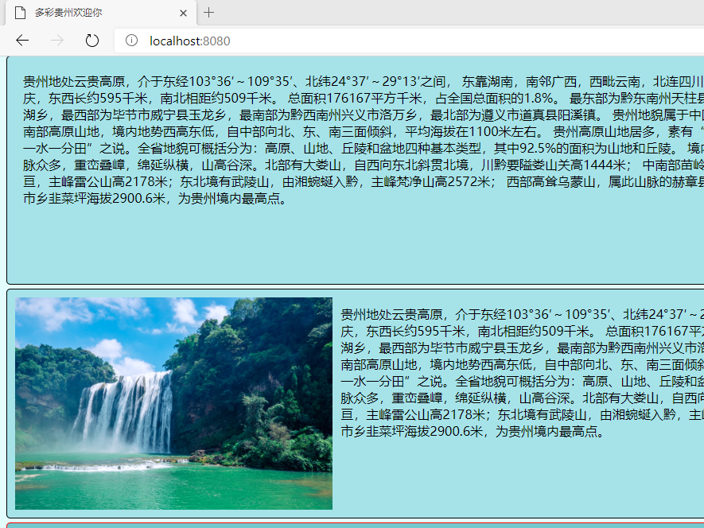

## 用什么编辑器写 ASP

我推荐 VScode，只要装一些插件就可以了

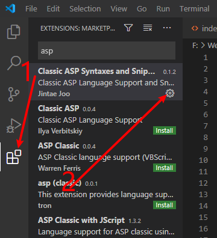

代码高亮效果如下：

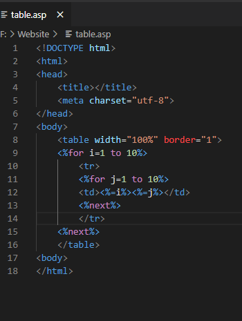

## ASP 几个小例子

asp 的基础语法看这个链接：https://www.w3school.com.cn/asp/index.asp

我举几个小例子：

### ASP 中 for 循环生成表格

```asp
<!DOCTYPE html>
<html>
<head>
  <title></title>
  <meta charset="utf-8">
</head>
<body>
  <table width="100%" border="1">
  <%for i=1 to 10%>
    <tr>
    <%for j=1 to 10%>
    <td><%=i%><%=j%></td>
    <%next%>　
    </tr>
  <%next%>
  </table>
<body>
</html>
```

效果如下：

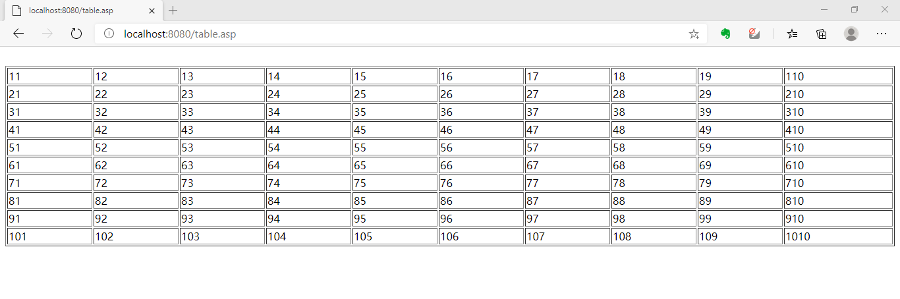

## 踩坑经验

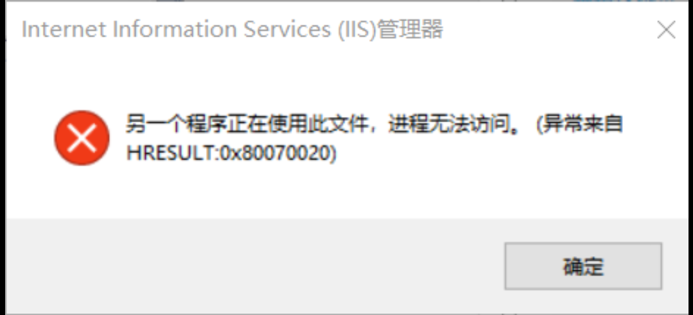

这个是因为端口 8080 被别的程序占用，更改端口就可以了。
