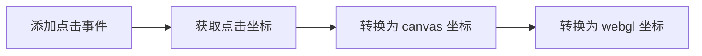
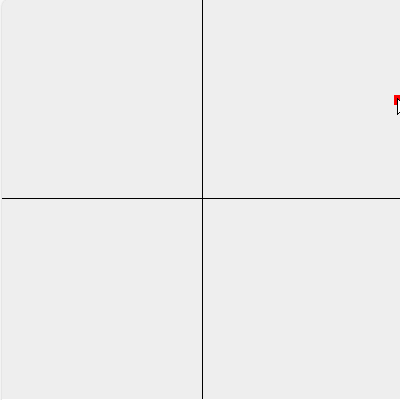

# 鼠标绘制

webgl 的 x, y, z 坐标轴，取值是从 -1 到 1。





```js
const program = initShader(gl, VERTEX_SHADER_SOURCE, FRAGMENT_SHADER_SOURCE)
const aPosition = gl.getAttribLocation(program, 'aPosition')

const points = []
canvas.onmousemove = function (event) {
  const { clientX, clientY } = event
  const domPosition = event.target.getBoundingClientRect()
  const { left, top, width, height } = domPosition
  const halfWidth = width / 2
  const halfHeight = height / 2

  const x = (clientX - halfWidth) / halfWidth
  const y = (halfHeight - clientY) / halfHeight

  points.push({ x, y })

  points.forEach(p => {
    gl.vertexAttrib2f(aPosition, p.x, p.y)
    gl.drawArrays(gl.POINTS, 0, 1)
  })
}
```
