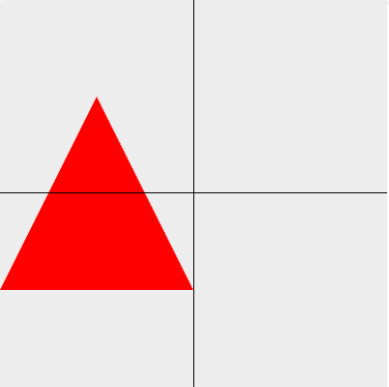
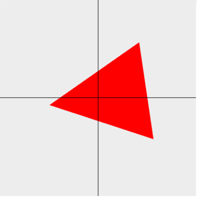

# 着色器实现图形动画

## 图形平移



关键代码如下：

```js
// ... 省略
const VERTEX_SHADER_SOURCE = `
  attribute vec4 aPosition;
  attribute float aTranslate;
  attribute float aPointSize;
  void main() {
    gl_Position = vec4(aPosition.x + aTranslate, aPosition.y, aPosition.z, 1.0);
    gl_PointSize = aPointSize;
  }
`
// ... 省略
const aTranslate = gl.getAttribLocation(program, 'aTranslate')
// ... 省略
let x = -1
setInterval(() => {
  x += 0.05
  if (x > 1) {
    x = -1
  }
  gl.vertexAttrib1f(aTranslate, x)
  gl.drawArrays(gl.TRIANGLES, 0, 3)
}, 60)
```

## 图形缩放


关键代码如下：

```js
// ... 省略
const VERTEX_SHADER_SOURCE = `
  attribute vec4 aPosition;
  attribute float aScale;
  attribute float aPointSize;
  void main() {
    gl_Position = vec4(aPosition.x * aScale, aPosition.y, aPosition.z, 1.0);
    gl_PointSize = aPointSize;
  }
`
// ... 省略
const aScale = gl.getAttribLocation(program, 'aScale')
// ... 省略
let x = 1
setInterval(() => {
  x += 0.1
  if (x > 2) {
    x = 1
  }
  gl.vertexAttrib1f(aScale, x)
  gl.drawArrays(gl.TRIANGLES, 0, 3)
}, 60)
```

## 旋转



关键代码如下：

```js
// ... 省略
const VERTEX_SHADER_SOURCE = `
  attribute vec4 aPosition;
  attribute float deg;
  void main() {
    gl_Position.x = aPosition.x * cos(deg) - aPosition.y * sin(deg);
    gl_Position.y = aPosition.x * sin(deg) + aPosition.y * cos(deg);
    gl_Position.z = aPosition.z;
    gl_Position.w = aPosition.w;
  }
`
// ... 省略
const deg = gl.getAttribLocation(program, 'deg')
// ... 省略
let x = 1

function animation() {
  x += 0.05
  gl.vertexAttrib1f(deg, x)
  gl.drawArrays(gl.TRIANGLES, 0, 3)
  requestAnimationFrame(animation)
}

animation()
```
