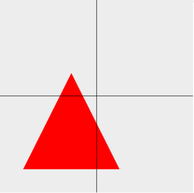
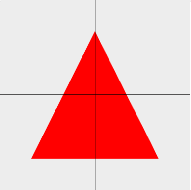
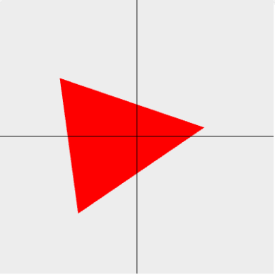
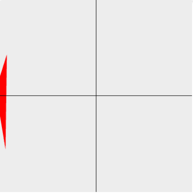

# 矩阵实现平移、旋转、缩放

## 平移矩阵

```
1, 0, 0, 0,
0, 1, 0, 0,
0, 0, 1, 0,
x1, y1, z1, 1,
```



```js
// ... 省略
const VERTEX_SHADER_SOURCE = `
  attribute vec4 aPosition;
  uniform mat4 mat;
  void main() {
    gl_Position = mat * aPosition;
  }
`
// ... 省略
const mat = gl.getUniformLocation(program, 'mat')

function getTranslateMatrix(x = 0, y = 0, z = 0) {
  return new Float32Array([
    1.0, 0.0, 0.0, 0.0,
    0.0, 1.0, 0.0, 0.0,
    0.0, 0.0, 1.0, 0.0,
    x, y, z, 1
  ])
}
// ... 省略
let x = 1

function animation() {
  x += 0.02
  if (x > 1) {
    x = -1
  }
  const matrix = getTranslateMatrix(x, x)
  gl.uniformMatrix4fv(mat, false, matrix)
  gl.drawArrays(gl.TRIANGLES, 0, 3)
  requestAnimationFrame(animation)
}

animation()
```

## 缩放矩阵

```
tx, 0, 0, 0,
0, ty, 0, 0,
0, 0, 0, tz,
0, 0, 0, 1,
```



```js
// ... 省略
function getScaleMatrix(x = 1, y = 1, z = 1) {
  return new Float32Array([
    x, 0.0, 0.0, 0.0,
    0.0, y, 0.0, 0.0,
    0.0, 0.0, z, 0.0,
    0.0, 0.0, 0.0, 1.0
  ])
}
// ... 省略
let x = 1

function animation() {
  x += 0.01
  if (x > 1.5) {
    x = 1
  }
  const matrix = getScaleMatrix(x, x)
  gl.uniformMatrix4fv(mat, false, matrix)
  gl.drawArrays(gl.TRIANGLES, 0, 3)
  requestAnimationFrame(animation)
}

animation()
```

## 旋转矩阵

```
cosβ, sinβ, 0.0, 0.0,
-sinβ, cosβ, 0.0, 0.0,
0.0, 0.0, 1.0, 0.0,
0.0, 0.0, 0.0, 1.0,
```



```js
// ... 省略
function getRotateMatrix(deg) {
  return new Float32Array([
    Math.cos(deg), Math.sin(deg), 0.0, 0.0,
    -Math.sin(deg), Math.cos(deg), 0.0, 0.0,
    0.0, 0.0, 1.0, 0.0,
    0.0, 0.0, 0.0, 1.0
  ])
}
// ... 省略
let x = 1

function animation() {
  x += 0.02
  const matrix = getRotateMatrix(x)
  gl.uniformMatrix4fv(mat, false, matrix)
  gl.drawArrays(gl.TRIANGLES, 0, 3)
  requestAnimationFrame(animation)
}

animation()
```

## 复合变化

如果同时存在平移、旋转、缩放的动画，那么可以三个矩阵相乘。



```js
// ... 省略
const VERTEX_SHADER_SOURCE = `
  attribute vec4 aPosition;
  uniform mat4 translateMatrix;
  unifrom mat4 rotateMatrix;
  uniform mat4 scaleMatrix;

  void main() {
    gl_Position = translateMatrix * rotateMatrix * scaleMatrix * aPosition;
  }
`
// ... 省略
```

不过这样就需要赋值三个变量，比较复杂，我们可以封装一个矩阵乘法的函数：

```js
// ... 省略
function mixMatrix(A, B) {
  const result = new Float32Array(16)
  for (let i = 0; i < 4; i++) {
    result[i] = A[i] * B[0] + A[i + 4] * B[1] + A[i + 8] * B[2] + A[i + 12] * B[3]
    result[i + 4] = A[i] * B[4] + A[i + 4] * B[5] + A[i + 8] * B[6] + A[i + 12] * B[7]
    result[i + 8] = A[i] * B[8] + A[i + 4] * B[9] + A[i + 8] * B[10] + A[i + 12] * B[11]
    result[i + 12] = [i] * B[12] + A[i + 4] * B[13] + A[i + 8] * B[14] + A[i + 12] * B[15]
  }
  return result
}
// ... 省略
let deg = 0
let translateX = -1
let scaleX = 0.1

function animation() {
  deg += 0.01
  translateX += 0.01
  scaleX += 0.01

  if (translateX > 1) {
    translateX = -1
  }
  if (scaleX > 1.5) {
    scaleX = 0.1
  }

  const translateMatrix = getTranslateMatrix(translateX)
  const scaleMatrix = getScaleMatrix(scaleX)
  const rotateMatrix = getRotateMatrix(deg)

  const matrix = mixMatrix(mixMatrix(translateMatrix, scaleMatrix), rotateMatrix)
  gl.uniformMatrix4fv(mat, false, matrix)
  gl.drawArrays(gl.TRIANGLES, 0, 3)
  requestAnimationFrame(animation)
}

animation()
```
