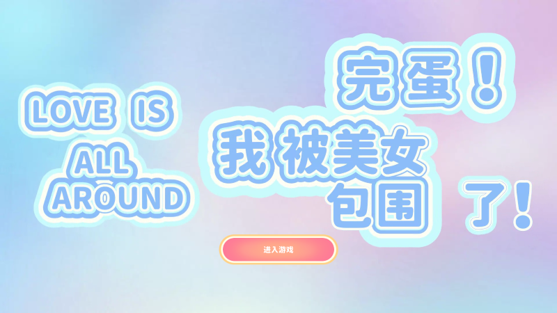

# 或许我们只是想单纯地享受美好 —— 《完蛋！我被美女包围了！》玩后感

最近，《完蛋！我被美女包围了！》这个游戏很火，我也跟风入手了。主角负债累累，但还是有 6 个美女喜欢他并倒贴，玩家只需要点各种选项推进剧情就行。介绍剧情、结局的文章视频已经很多了，所以我这里想谈些杂七杂八别的东西。

总所周知，玩这种攻略游戏其实很简单，如果你喜欢某个角色，你就一直选择加这个角色好感度的选项就行。但就是这样一个简单的动作，也会有意想不到的困难，那就是太难选了。

游戏前期，我真的是走马观花，见一个爱一个。因为没有哪一个足够让我心动。直到沈慧星出场，在和她谈几句话之后，我就决定追求沈慧星了。

我觉得沈慧星很好懂，和她在一起很轻松。咋说呢，就感觉平时上班、生活已经蛮累了，不想再动什么脑子，只想享受单纯的美好。

当然，这一切的简单，都建立在沈慧星生活在一个养尊处优的环境，所以她的人设里没有那么多考量的东西。对比之下，肖鹿的人设也是单纯可爱，但因为背上了世俗的债务，总感觉她的脸上带着一种委屈。

这种委屈我可太熟悉了，那就是被生活压迫苦中作乐的委屈。因为我真的穷过，所以我对这种委屈感受非常深。

我觉得这个代表了心理的一种追求，就是在我自己的内心深处，我是感觉感情应该是简单的，不想费脑子的。然而随着时间的流逝，恋爱将会变得越来越复杂。

我感觉这很像是软件，我们经常称赞一个产品小而美，但往往一个简洁大方的软件，背后其实藏着无数的先决条件，你用起来的畅快，其实背后有着好多你不知道的功能。

这个游戏玩到沈慧星结局后，我其实没有太多动力再玩下去了。

对我来说，去集齐各种解决反倒成为了一种负担。我更喜欢随便点点，然后偶尔还能够发现一些沈慧星的新彩蛋。
