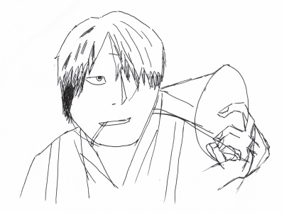
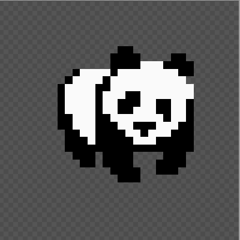
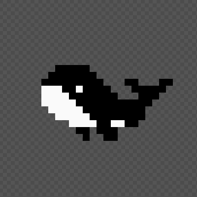

# 我的像素画尝试

大家好，我俊霖。今天和大家聊一聊我的像素画尝试。

我没有任何美术功底，看到自己喜欢的画作时，只能幻想自己能够画出这样的作品，一旦真正上手，画出来的东西很难入眼。

请看下方的画，左一是《虫师》的男主银谷，中间是我在数位板画的银谷。嗯，根据发型和脸型，应该勉强能认出是同一个人。至于手，我自己都看不下去了。我想画的是《虫师》男主，不是《寄生兽》男主啊。

| 《虫师》 | 我自己的画 | 《寄生兽》 |
| -- | -- | -- |
|  |  |   |

分析了下原因，我画画时手不稳。根据我零散看过的速写书、素描书，绘画需要从最基本的线条练起，控笔是最基础的技能，掌握后才能进入下一阶段的练习。

我既没有时间、也没有精力去花费时间练习这种基础技能，有希望能够画出能看得过眼的作品，那该怎么办呢？答案就是像素画。

像素画其实也不是我个人专属的，很多个人开发游戏的程序员，都会选择像素画这种画风。

| 狗头 | 熊猫 | 鲸鱼 |
| -- | -- | -- |
|  |  |  |

[https://www.piskelapp.com/](https://www.piskelapp.com/)
