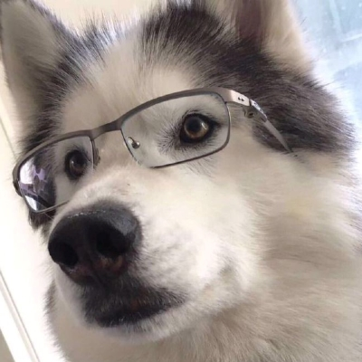
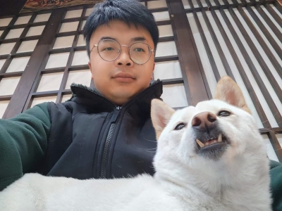

# 叶公好哈士奇

朋友们都以为我喜欢哈士奇。因为我的头像是哈士奇，网站 logo 是哈士奇，曾用网名是「西伯利亚雪橇犬」。

**但目前为止，我没有摸过活着的哈士奇**。我了解的哈士奇，都是视频和图片里的哈士奇。与其说我喜欢的是哈士奇，不如说我喜欢的自己想象中的哈士奇。

那我喜欢哈士奇的什么呢？

首先是哈士奇的外貌，帅气的哈士奇非常符号我的审美，优雅、端正、美丽。

然后是哈士奇旺盛的精力。

之后是哈士奇代表的那种自由的感觉。它是那种在冰天雪地里，快乐奔跑的狗，而不是关在笼子里的狗。

就我实际去过的狗咖来看，狗还是比较势利的，前一秒还在你的怀里撒娇，没吃的立刻弃你而去。还有一些狗比较渣，吃了你的狗粮，但是却不肯给你摸。

