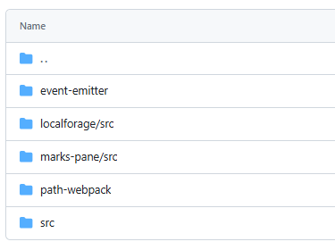
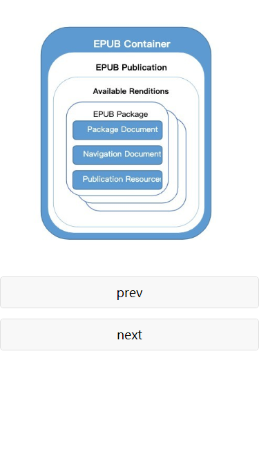
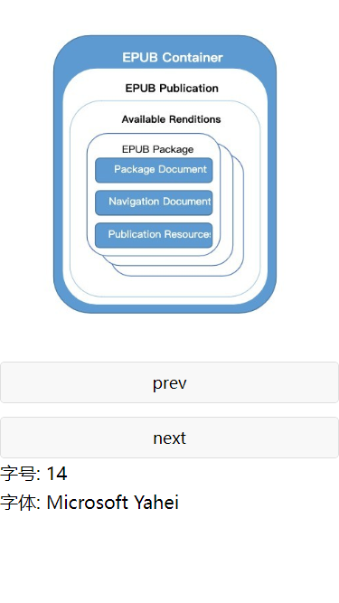

# 开发日志

## 2024.07.24

### Epub 的错误

它的依赖关系是，epubjs 依赖了 event-emitter，而 event-emitter 又依赖了 es5-ext，而 es5-ext 中，它的文件路径中包含了一个 # 号。

epubjs 底层的依赖非常混乱。在我看来，它的 lodash、es5-ext 还有 d 都是重复的，完全可以优化。

https://github.com/webpack/enhanced-resolve/issues/282

我猜测是因为 epubjs 一直迭代，然后后面维护的人已经开始使用 es5 和 es6 的语法了，但是又不愿意重构之前的代码，就演变成这个样子了。

于是我干脆把 epubjs 拷贝了一份，然后把它依赖的 es5-ext 和 d 都拷贝整理了一份。

最终我认为，epubjs 实际需要的依赖只有 3 个：@xmldom/xmldom 和 jszip 和 lodash。

它的其他依赖，完全可以自己手写代替：

### 小程序上解析错误

因为 epubjs 自己用 XMLHttpRequest 实现了请求。

此外 event-emitter 太离谱了，竟然已经三年没更新了

https://github.com/medikoo/event-emitter

## 2024.07.25

设置字体大小、字体

epubjs 的 rendition 内部有一个 themes，通过设置 themes 的 fontSize 和 font，我们可以改变字体大小、字体。

http://epubjs.org/documentation/0.3/#themes

